# IT Infrastructure Ontology - Visual Diagrams

## Document Information

- **Version**: 1.0.0
- **Date**: 2024-01-15
- **Purpose**: Visual representations of the ontology structure, relationships, and deployment patterns

---

## Table of Contents

1. [Layer Architecture Diagram](#layer-architecture-diagram)
2. [Entity-Relationship Diagrams by Layer](#entity-relationship-diagrams-by-layer)
3. [Cross-Layer Relationship Diagrams](#cross-layer-relationship-diagrams)
4. [Deployment Pattern Diagrams](#deployment-pattern-diagrams)
5. [Class Hierarchy Diagrams](#class-hierarchy-diagrams)

---

## Layer Architecture Diagram

### Six-Layer Architecture Overview

```mermaid
graph TB
    subgraph Layer1["Layer 1: Business Processes"]
        BP[BusinessProcess]
        BC[BusinessCapability]
        BS[BusinessService]
        P[Product]
    end
    
    subgraph Layer2["Layer 2: Application Layer"]
        APP[Application]
        AC[ApplicationComponent]
        SVC[Service]
        API[API]
        DB[Database]
        MQ[MessageQueue]
        FS[FileStorageService]
        OS[ObjectStorageService]
    end
    
    subgraph Layer3["Layer 3: Container & Orchestration"]
        C[Container]
        POD[Pod]
        CI[ContainerImage]
        CL[Cluster]
        NS[Namespace]
        DEP[Deployment]
        K8S[KubernetesService]
        RT[Route]
    end
    
    subgraph Layer4["Layer 4: Physical Infrastructure"]
        PS[PhysicalServer]
        VM[VirtualMachine]
        HV[Hypervisor]
        AS[ApplicationServer]
        CINST[CloudInstance]
        SA[StorageArray]
        SV[StorageVolume]
        FSYS[FileSystem]
    end
    
    subgraph Layer5["Layer 5: Network Topology"]
        ND[NetworkDevice]
        LB[LoadBalancer]
        NI[NetworkInterface]
        NSG[NetworkSegment]
        CP[CommunicationPath]
    end
    
    subgraph Layer6["Layer 6: Security Infrastructure"]
        FW[Firewall]
        WAF[WAF]
        CERT[Certificate]
        CA[CertificateAuthority]
        SP[SecurityPolicy]
        IDP[IdentityProvider]
        SZ[SecurityZone]
    end
    
    BP -->|realized_by| APP
    APP -->|deployed_as| POD
    APP -->|hosted_on| AS
    AS -->|runs_on| VM
    POD -->|runs_on| VM
    VM -->|runs_on| PS
    APP -->|communicates_via| CP
    APP -->|protected_by| FW
    DB -->|stored_on| SV
    SV -->|allocated_from| SA
    
    style Layer1 fill:#e1f5ff
    style Layer2 fill:#fff4e1
    style Layer3 fill:#e8f5e9
    style Layer4 fill:#fce4ec
    style Layer5 fill:#f3e5f5
    style Layer6 fill:#fff9c4
```

---

## Entity-Relationship Diagrams by Layer

### Layer 1: Business Process Layer

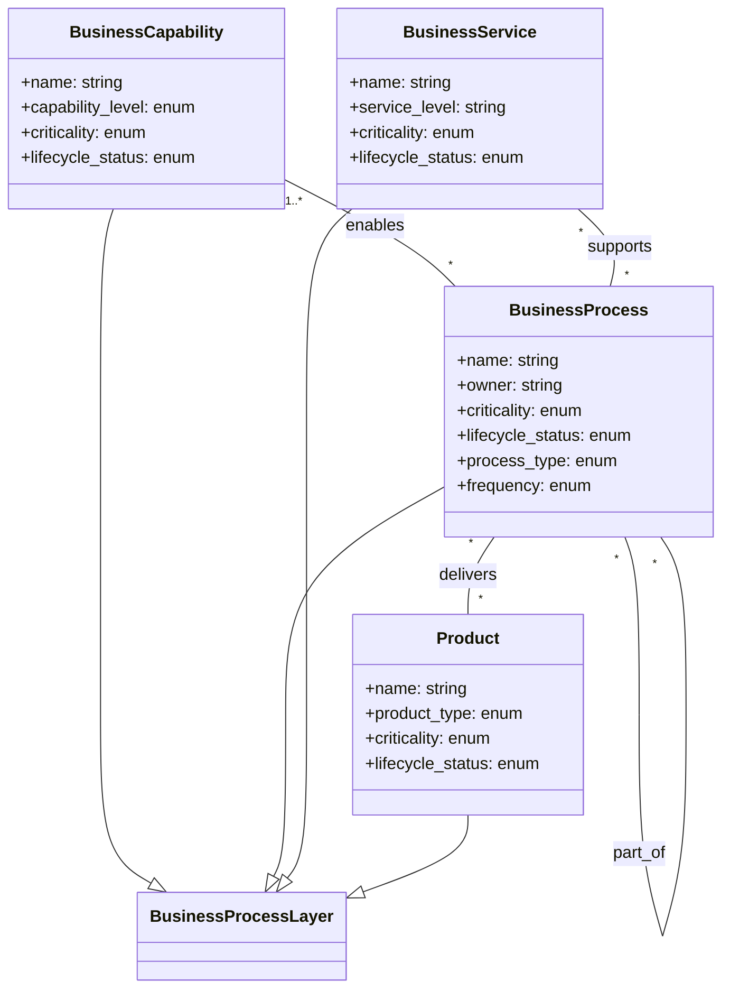

### Layer 2: Application Layer

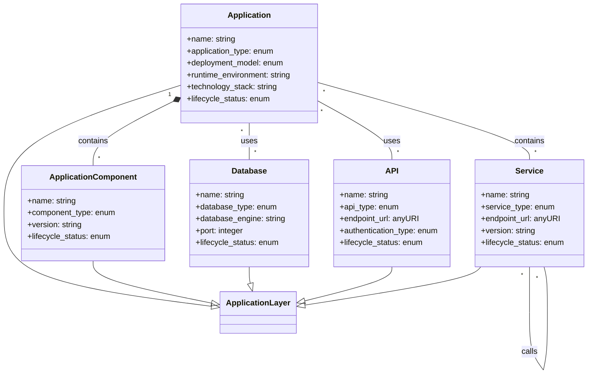

### Layer 3: Container and Orchestration Layer

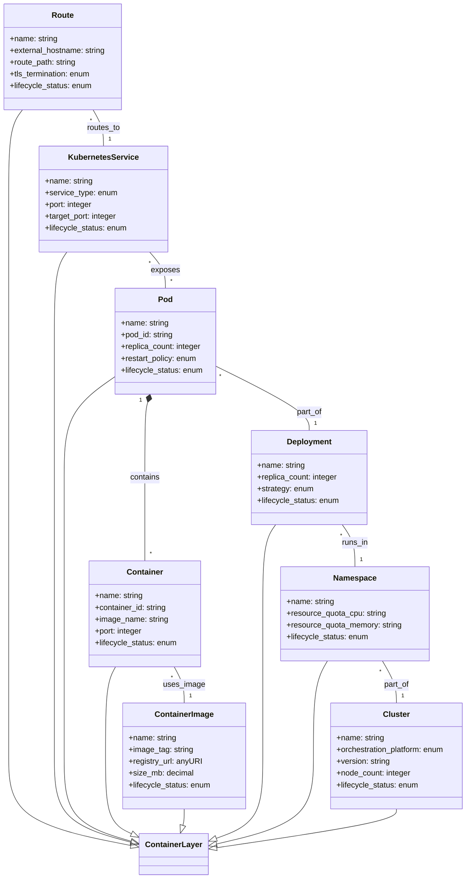

### Layer 4: Physical Infrastructure Layer

```mermaid
classDiagram
    class PhysicalServer {
        +name: string
        +resource_type: enum
        +cpu_count: integer
        +memory_gb: decimal
        +location: string
        +lifecycle_status: enum
    }
    
    class VirtualMachine {
        +name: string
        +resource_type: enum
        +vcpu_count: integer
        +memory_gb: decimal
        +operating_system: string
        +lifecycle_status: enum
    }
    
    class Hypervisor {
        +name: string
        +hypervisor_type: enum
        +version: string
        +lifecycle_status: enum
    }
    
    class CloudInstance {
        +name: string
        +cloud_provider: enum
        +instance_type: string
        +region: string
        +lifecycle_status: enum
    }
    
    class ApplicationServer {
        +name: string
        +server_type: enum
        +version: string
        +port: integer
        +resource_type: enum
        +lifecycle_status: enum
    }
    
    class StorageArray {
        +name: string
        +storage_type: enum
        +capacity_tb: decimal
        +location: string
        +lifecycle_status: enum
    }
    
    class StorageVolume {
        +name: string
        +capacity_gb: decimal
        +volume_type: enum
        +lifecycle_status: enum
    }
    
    class FileSystem {
        +name: string
        +filesystem_type: enum
        +mount_point: string
        +capacity_gb: decimal
        +lifecycle_status: enum
    }
    
    PhysicalServer --|> PhysicalInfrastructureLayer
    VirtualMachine --|> PhysicalInfrastructureLayer
    Hypervisor --|> PhysicalInfrastructureLayer
    CloudInstance --|> PhysicalInfrastructureLayer
    ApplicationServer --|> PhysicalInfrastructureLayer
    StorageArray --|> PhysicalInfrastructureLayer
    StorageVolume --|> PhysicalInfrastructureLayer
    FileSystem --|> PhysicalInfrastructureLayer
    
    VirtualMachine "*" -- "1" Hypervisor : runs_on
    Hypervisor "*" -- "1" PhysicalServer : runs_on
    ApplicationServer "*" -- "1" VirtualMachine : runs_on
    ApplicationServer "*" -- "1" PhysicalServer : runs_on
    ApplicationServer "*" -- "1" CloudInstance : runs_on
    StorageVolume "*" -- "1" StorageArray : allocated_from
    FileSystem "*" -- "1" StorageVolume : mounted_from
```

### Layer 5: Network Topology Layer

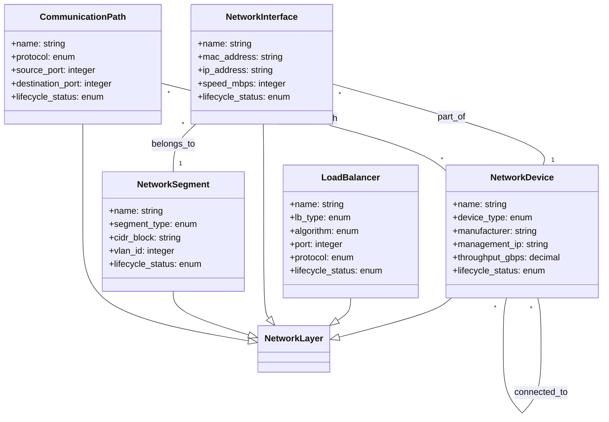

### Layer 6: Security Infrastructure Layer

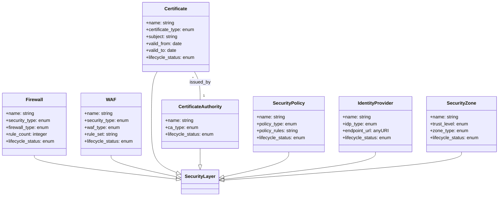

---

## Cross-Layer Relationship Diagrams

### Full Stack Decomposition: Business to Infrastructure

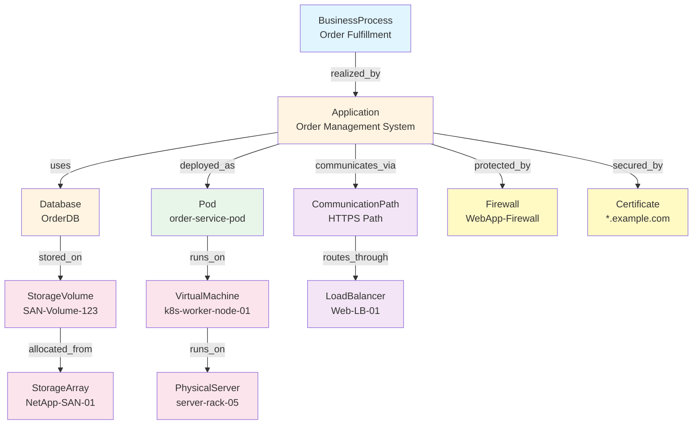

### Containerized Application Deployment Pattern

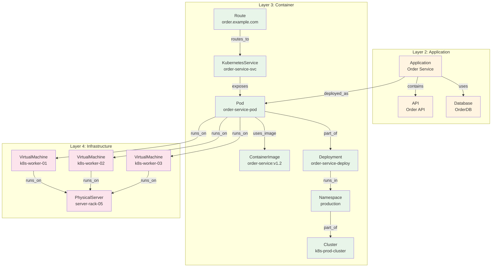

### Legacy Application Deployment Pattern

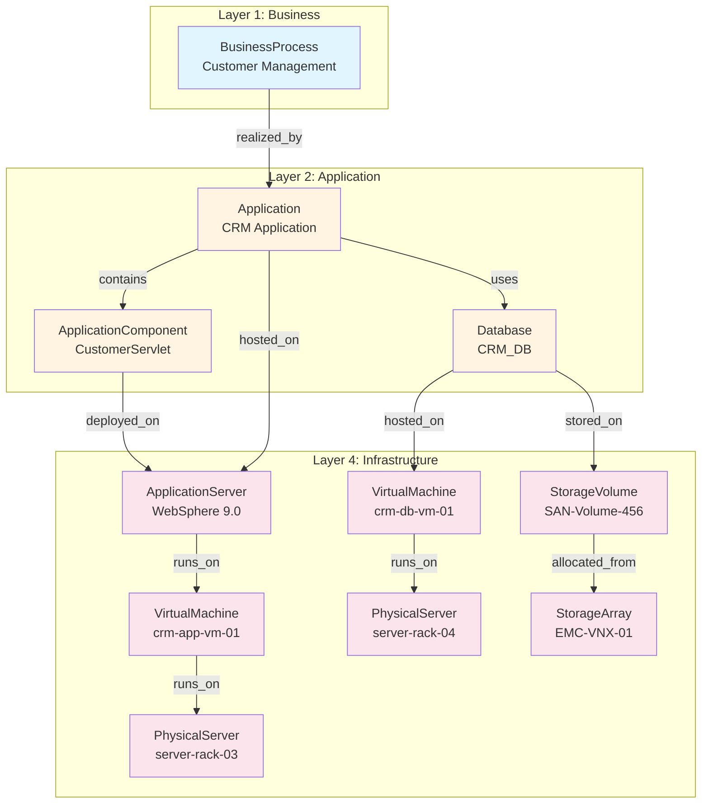

### Microservices Architecture with Service Mesh

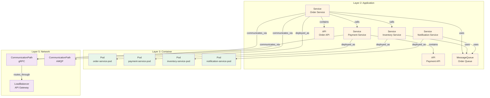

---

## Deployment Pattern Diagrams

### Pattern 1: On-Premises Infrastructure

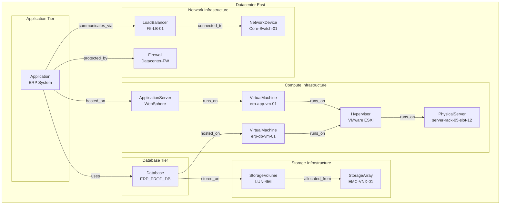

### Pattern 2: Cloud-Native Architecture (AWS)

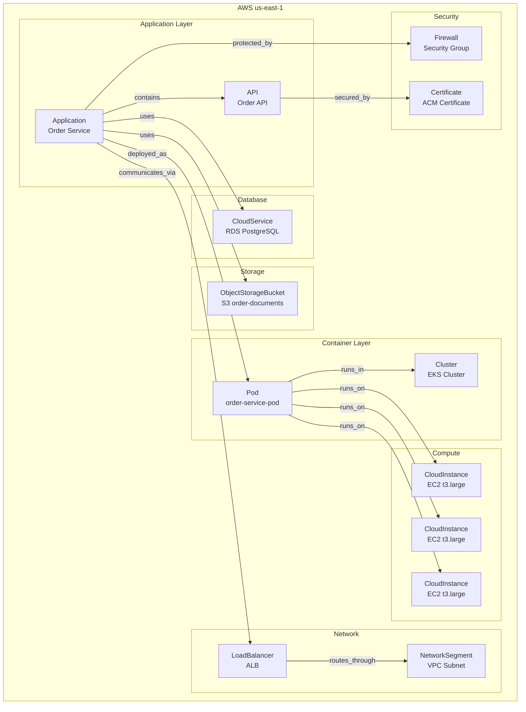

### Pattern 3: Hybrid Cloud Architecture

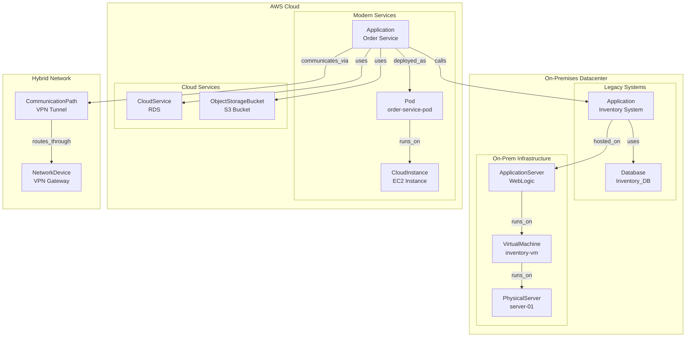

### Pattern 4: Multi-Cloud Architecture

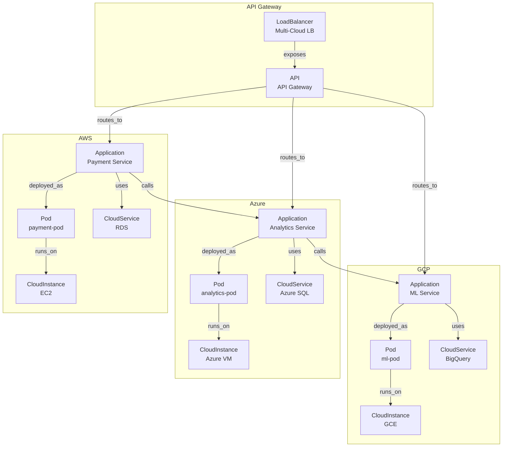

---

## Class Hierarchy Diagrams

### Complete Class Hierarchy


### Relationship Type Hierarchy

```mermaid
graph TD
    OP[owl:ObjectProperty<br/>Relationships]
    
    OP --> INTRA[Intra-Layer<br/>Relationships]
    OP --> CROSS[Cross-Layer<br/>Relationships]
    
    INTRA --> COMP[Composition]
    INTRA --> ENABLE[Enablement]
    INTRA --> SUPPORT[Support]
    INTRA --> CONNECT[Connectivity]
    INTRA --> ISSUE[Issuance]
    
    COMP --> PO[part_of]
    COMP --> CONT[contains]
    
    ENABLE --> EN[enables]
    ENABLE --> EB[enabled_by]
    
    SUPPORT --> SUP[supports]
    SUPPORT --> SB[supported_by]
    
    CONNECT --> CT[connected_to]
    
    ISSUE --> IB[issued_by]
    ISSUE --> ISS[issues]
    
    CROSS --> REAL[Realization]
    CROSS --> DEPLOY[Deployment]
    CROSS --> HOST[Hosting]
    CROSS --> USE[Usage]
    CROSS --> COMM[Communication]
    CROSS --> SEC[Security]
    CROSS --> STOR[Storage]
    
    REAL --> RB[realized_by]
    REAL --> REQ[requires]
    
    DEPLOY --> DA[deployed_as]
    DEPLOY --> PI[packaged_in]
    
    HOST --> RO[runs_on]
    HOST --> HO[hosted_on]
    HOST --> H[hosts]
    
    USE --> U[uses]
    USE --> C[calls]
    
    COMM --> CV[communicates_via]
    COMM --> RT[routes_through]
    
    SEC --> PB[protected_by]
    SEC --> SBY[secured_by]
    
    STOR --> SO[stored_on]
    STOR --> SI[stored_in]
    STOR --> AF[allocated_from]
    STOR --> MF[mounted_from]
    
    style OP fill:#e1f5ff
    style INTRA fill:#fff4e1
    style CROSS fill:#e8f5e9
```

### Data Property Hierarchy

```mermaid
graph TD
    DP[owl:DatatypeProperty<br/>Attributes]
    
    DP --> COMMON[Common<br/>Attributes]
    DP --> L1[Layer 1<br/>Attributes]
    DP --> L2[Layer 2<br/>Attributes]
    DP --> L3[Layer 3<br/>Attributes]
    DP --> L4[Layer 4<br/>Attributes]
    DP --> L5[Layer 5<br/>Attributes]
    DP --> L6[Layer 6<br/>Attributes]
    
    COMMON --> NAME[name]
    COMMON --> DESC[description]
    COMMON --> OWNER[owner]
    COMMON --> CRIT[criticality]
    COMMON --> LS[lifecycle_status]
    COMMON --> VER[version]
    COMMON --> LOC[location]
    
    L1 --> PT[process_type]
    L1 --> FREQ[frequency]
    L1 --> MAT[maturity_level]
    L1 --> CAP[capability_level]
    
    L2 --> AT[application_type]
    L2 --> DM[deployment_model]
    L2 --> RE[runtime_environment]
    L2 --> TS[technology_stack]
    L2 --> DC[data_classification]
    L2 --> DBT[database_type]
    L2 --> APITY[api_type]
    
    L3 --> IMG[image_name]
    L3 --> OP[orchestration_platform]
    L3 --> RC[replica_count]
    L3 --> RL[resource_limits]
    L3 --> TLS[tls_termination]
    
    L4 --> RT[resource_type]
    L4 --> CPU[cpu_count/vcpu_count]
    L4 --> MEM[memory_gb]
    L4 --> OS[operating_system]
    L4 --> CP[cloud_provider]
    L4 --> CAP4[capacity_gb/capacity_tb]
    
    L5 --> DT[device_type]
    L5 --> IP[ip_address]
    L5 --> MAC[mac_address]
    L5 --> CIDR[cidr_block]
    L5 --> PROTO[protocol]
    L5 --> BW[bandwidth_mbps]
    
    L6 --> ST[security_type]
    L6 --> FT[firewall_type]
    L6 --> CT[certificate_type]
    L6 --> VF[valid_from]
    L6 --> VT[valid_to]
    L6 --> TL[trust_level]
    
    style DP fill:#e1f5ff
    style COMMON fill:#fff4e1
    style L1 fill:#e8f5e9
    style L2 fill:#fce4ec
    style L3 fill:#f3e5f5
    style L4 fill:#fff9c4
    style L5 fill:#e1f5ff
    style L6 fill:#fff4e1
```

---

## Component Relationship Diagrams

This section provides detailed relationship diagrams for each major component, showing all connections to neighboring components across layers.

### Application Component Relationships

```mermaid
graph TB
    subgraph "Layer 1: Business"
        BP[BusinessProcess]
        BC[BusinessCapability]
        BS[BusinessService]
        P[Product]
    end
    
    subgraph "Layer 2: Application - Focus"
        APP[Application<br/><b>FOCUS COMPONENT</b>]
        AC[ApplicationComponent]
        SVC[Service]
        API[API]
        DB[Database]
        MQ[MessageQueue]
        CACHE[CacheService]
    end
    
    subgraph "Layer 3: Container"
        POD[Pod]
        CONT[Container]
    end
    
    subgraph "Layer 4: Infrastructure"
        AS[ApplicationServer]
        VM[VirtualMachine]
        CI[CloudInstance]
    end
    
    subgraph "Layer 5: Network"
        CP[CommunicationPath]
        LB[LoadBalancer]
    end
    
    subgraph "Layer 6: Security"
        FW[Firewall]
        WAF[WAF]
        CERT[Certificate]
        IDP[IdentityProvider]
        SZ[SecurityZone]
    end
    
    %% Upward relationships (to Business)
    BP -->|realized_by| APP
    BC -->|realized_by| APP
    BS -->|realized_by| APP
    P -->|requires| APP
    
    %% Intra-layer relationships
    APP -->|contains| AC
    APP -->|contains| SVC
    APP -->|exposes| API
    APP -->|uses| DB
    APP -->|uses| MQ
    APP -->|uses| CACHE
    SVC -->|calls| SVC
    
    %% Downward relationships (to Container)
    APP -->|deployed_as| POD
    APP -->|packaged_in| CONT
    
    %% Downward relationships (to Infrastructure)
    APP -->|hosted_on| AS
    APP -->|hosted_on| VM
    APP -->|hosted_on| CI
    
    %% Cross-layer (to Network)
    APP -->|communicates_via| CP
    APP -->|exposes_via| LB
    
    %% Cross-layer (to Security)
    APP -->|protected_by| FW
    APP -->|protected_by| WAF
    APP -->|uses_certificate| CERT
    APP -->|authenticated_by| IDP
    APP -->|belongs_to_zone| SZ
    
    style APP fill:#ffeb3b,stroke:#f57c00,stroke-width:4px
    style BP fill:#e1f5ff
    style BC fill:#e1f5ff
    style BS fill:#e1f5ff
    style P fill:#e1f5ff
    style AC fill:#fff4e1
    style SVC fill:#fff4e1
    style API fill:#fff4e1
    style DB fill:#fff4e1
    style MQ fill:#fff4e1
    style CACHE fill:#fff4e1
    style POD fill:#e8f5e9
    style CONT fill:#e8f5e9
    style AS fill:#fce4ec
    style VM fill:#fce4ec
    style CI fill:#fce4ec
    style CP fill:#f3e5f5
    style LB fill:#f3e5f5
    style FW fill:#fff9c4
    style WAF fill:#fff9c4
    style CERT fill:#fff9c4
    style IDP fill:#fff9c4
    style SZ fill:#fff9c4
```

### ApplicationServer Component Relationships

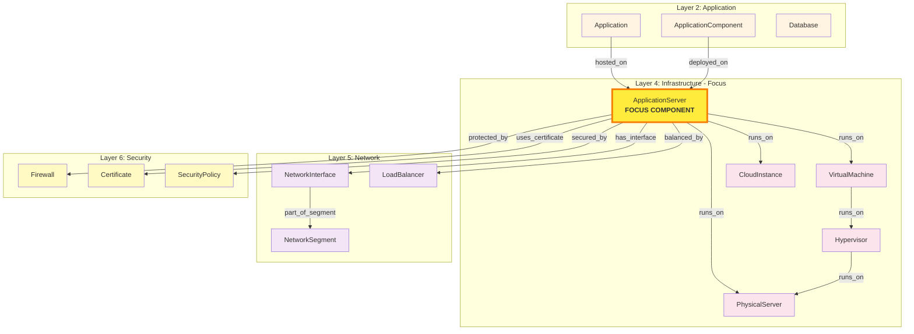

### Database Component Relationships

```mermaid
graph TB
    subgraph "Layer 2: Application - Focus"
        DB[Database<br/><b>FOCUS COMPONENT</b>]
        DBI[DatabaseInstance]
        DO[DataObject]
        APP[Application]
        SVC[Service]
    end
    
    subgraph "Layer 4: Infrastructure"
        VM[VirtualMachine]
        CI[CloudInstance]
        CS[CloudService]
        SV[StorageVolume]
        FS[FileSystem]
        CSS[CloudStorageService]
    end
    
    subgraph "Layer 5: Network"
        CP[CommunicationPath]
        NSG[NetworkSegment]
        NI[NetworkInterface]
    end
    
    subgraph "Layer 6: Security"
        FW[Firewall]
        SP[SecurityPolicy]
        SZ[SecurityZone]
    end
    
    %% Intra-layer relationships
    DB -->|contains| DBI
    DB -->|contains| DO
    APP -->|uses| DB
    SVC -->|uses| DB
    
    %% Downward relationships (to Infrastructure)
    DB -->|hosted_on| VM
    DB -->|hosted_on| CI
    DB -->|hosted_on| CS
    DB -->|stored_on| SV
    DB -->|stored_on| FS
    DB -->|stored_on| CSS
    
    %% Cross-layer (to Network)
    DB -->|communicates_via| CP
    DB -->|has_interface| NI
    NI -->|part_of_segment| NSG
    
    %% Cross-layer (to Security)
    DB -->|protected_by| FW
    DB -->|secured_by| SP
    DB -->|belongs_to_zone| SZ
    
    style DB fill:#ffeb3b,stroke:#f57c00,stroke-width:4px
    style DBI fill:#fff4e1
    style DO fill:#fff4e1
    style APP fill:#fff4e1
    style SVC fill:#fff4e1
    style VM fill:#fce4ec
    style CI fill:#fce4ec
    style CS fill:#fce4ec
    style SV fill:#fce4ec
    style FS fill:#fce4ec
    style CSS fill:#fce4ec
    style CP fill:#f3e5f5
    style NSG fill:#f3e5f5
    style NI fill:#f3e5f5
    style FW fill:#fff9c4
    style SP fill:#fff9c4
    style SZ fill:#fff9c4
```

### Container/Pod Component Relationships

```mermaid
graph TB
    subgraph "Layer 2: Application"
        APP[Application]
        SVC[Service]
    end
    
    subgraph "Layer 3: Container - Focus"
        POD[Pod<br/><b>FOCUS COMPONENT</b>]
        CONT[Container]
        IMG[ContainerImage]
        DEP[Deployment]
        K8S[KubernetesService]
        RT[Route]
        NS[Namespace]
        CL[Cluster]
    end
    
    subgraph "Layer 4: Infrastructure"
        VM[VirtualMachine]
        CI[CloudInstance]
        PS[PhysicalServer]
        SV[StorageVolume]
    end
    
    subgraph "Layer 5: Network"
        LB[LoadBalancer]
        NI[NetworkInterface]
        NSG[NetworkSegment]
    end
    
    subgraph "Layer 6: Security"
        FW[Firewall]
        SP[SecurityPolicy]
        SZ[SecurityZone]
    end
    
    %% Upward relationships (from Application)
    APP -->|deployed_as| POD
    SVC -->|deployed_as| POD
    
    %% Intra-layer relationships
    POD -->|contains| CONT
    CONT -->|uses_image| IMG
    POD -->|part_of| DEP
    POD -->|runs_in| NS
    NS -->|part_of| CL
    K8S -->|exposes| POD
    RT -->|routes_to| K8S
    
    %% Downward relationships (to Infrastructure)
    POD -->|runs_on| VM
    POD -->|runs_on| CI
    VM -->|runs_on| PS
    POD -->|uses| SV
    
    %% Cross-layer (to Network)
    POD -->|balanced_by| LB
    POD -->|has_interface| NI
    NI -->|part_of_segment| NSG
    
    %% Cross-layer (to Security)
    POD -->|protected_by| FW
    POD -->|secured_by| SP
    POD -->|belongs_to_zone| SZ
    
    style POD fill:#ffeb3b,stroke:#f57c00,stroke-width:4px
    style APP fill:#fff4e1
    style SVC fill:#fff4e1
    style CONT fill:#e8f5e9
    style IMG fill:#e8f5e9
    style DEP fill:#e8f5e9
    style K8S fill:#e8f5e9
    style RT fill:#e8f5e9
    style NS fill:#e8f5e9
    style CL fill:#e8f5e9
    style VM fill:#fce4ec
    style CI fill:#fce4ec
    style PS fill:#fce4ec
    style SV fill:#fce4ec
    style LB fill:#f3e5f5
    style NI fill:#f3e5f5
    style NSG fill:#f3e5f5
    style FW fill:#fff9c4
    style SP fill:#fff9c4
    style SZ fill:#fff9c4
```

### VirtualMachine Component Relationships

```mermaid
graph TB
    subgraph "Layer 2: Application"
        APP[Application]
        DB[Database]
    end
    
    subgraph "Layer 3: Container"
        POD[Pod]
        CL[Cluster]
    end
    
    subgraph "Layer 4: Infrastructure - Focus"
        VM[VirtualMachine<br/><b>FOCUS COMPONENT</b>]
        AS[ApplicationServer]
        HV[Hypervisor]
        PS[PhysicalServer]
        SV[StorageVolume]
        FS[FileSystem]
    end
    
    subgraph "Layer 5: Network"
        NI[NetworkInterface]
        NSG[NetworkSegment]
        LB[LoadBalancer]
    end
    
    subgraph "Layer 6: Security"
        FW[Firewall]
        SP[SecurityPolicy]
        SZ[SecurityZone]
    end
    
    %% Upward relationships (from Application & Container)
    APP -->|hosted_on| VM
    DB -->|hosted_on| VM
    POD -->|runs_on| VM
    AS -->|runs_on| VM
    CL -->|uses| VM
    
    %% Intra-layer relationships
    VM -->|runs_on| HV
    HV -->|runs_on| PS
    VM -->|uses| SV
    VM -->|uses| FS
    
    %% Cross-layer (to Network)
    VM -->|has_interface| NI
    NI -->|part_of_segment| NSG
    VM -->|balanced_by| LB
    
    %% Cross-layer (to Security)
    VM -->|protected_by| FW
    VM -->|secured_by| SP
    VM -->|belongs_to_zone| SZ
    
    style VM fill:#ffeb3b,stroke:#f57c00,stroke-width:4px
    style APP fill:#fff4e1
    style DB fill:#fff4e1
    style POD fill:#e8f5e9
    style CL fill:#e8f5e9
    style AS fill:#fce4ec
    style HV fill:#fce4ec
    style PS fill:#fce4ec
    style SV fill:#fce4ec
    style FS fill:#fce4ec
    style NI fill:#f3e5f5
    style NSG fill:#f3e5f5
    style LB fill:#f3e5f5
    style FW fill:#fff9c4
    style SP fill:#fff9c4
    style SZ fill:#fff9c4
```

### LoadBalancer Component Relationships

```mermaid
graph TB
    subgraph "Layer 2: Application"
        APP[Application]
        SVC[Service]
        API[API]
    end
    
    subgraph "Layer 3: Container"
        POD[Pod]
        K8S[KubernetesService]
        RT[Route]
    end
    
    subgraph "Layer 4: Infrastructure"
        VM[VirtualMachine]
        CI[CloudInstance]
        AS[ApplicationServer]
    end
    
    subgraph "Layer 5: Network - Focus"
        LB[LoadBalancer<br/><b>FOCUS COMPONENT</b>]
        ND[NetworkDevice]
        NSG[NetworkSegment]
        CP[CommunicationPath]
        NI[NetworkInterface]
    end
    
    subgraph "Layer 6: Security"
        FW[Firewall]
        CERT[Certificate]
        SP[SecurityPolicy]
    end
    
    %% Upward relationships (from Application & Container)
    APP -->|exposes_via| LB
    SVC -->|exposes_via| LB
    API -->|exposes_via| LB
    RT -->|routes_to| LB
    
    %% Intra-layer relationships
    LB -->|connected_to| ND
    LB -->|part_of_segment| NSG
    LB -->|routes_through| CP
    LB -->|has_interface| NI
    
    %% Downward relationships (to Infrastructure)
    LB -->|balances_to| VM
    LB -->|balances_to| CI
    LB -->|balances_to| AS
    LB -->|balances_to| POD
    
    %% Cross-layer (to Security)
    LB -->|protected_by| FW
    LB -->|uses_certificate| CERT
    LB -->|secured_by| SP
    
    style LB fill:#ffeb3b,stroke:#f57c00,stroke-width:4px
    style APP fill:#fff4e1
    style SVC fill:#fff4e1
    style API fill:#fff4e1
    style POD fill:#e8f5e9
    style K8S fill:#e8f5e9
    style RT fill:#e8f5e9
    style VM fill:#fce4ec
    style CI fill:#fce4ec
    style AS fill:#fce4ec
    style ND fill:#f3e5f5
    style NSG fill:#f3e5f5
    style CP fill:#f3e5f5
    style NI fill:#f3e5f5
    style FW fill:#fff9c4
    style CERT fill:#fff9c4
    style SP fill:#fff9c4
```

### Certificate Component Relationships

```mermaid
graph TB
    subgraph "Layer 2: Application"
        APP[Application]
        API[API]
        SVC[Service]
    end
    
    subgraph "Layer 3: Container"
        RT[Route]
        IG[IngressController]
    end
    
    subgraph "Layer 4: Infrastructure"
        AS[ApplicationServer]
    end
    
    subgraph "Layer 5: Network"
        LB[LoadBalancer]
    end
    
    subgraph "Layer 6: Security - Focus"
        CERT[Certificate<br/><b>FOCUS COMPONENT</b>]
        CA[CertificateAuthority]
        SP[SecurityPolicy]
        IDP[IdentityProvider]
    end
    
    %% Upward relationships (from all layers)
    APP -->|uses_certificate| CERT
    API -->|uses_certificate| CERT
    SVC -->|uses_certificate| CERT
    RT -->|uses_certificate| CERT
    IG -->|uses_certificate| CERT
    AS -->|uses_certificate| CERT
    LB -->|uses_certificate| CERT
    
    %% Intra-layer relationships
    CERT -->|issued_by| CA
    CA -->|trusts| CA
    CERT -->|governed_by| SP
    IDP -->|uses_certificate| CERT
    
    style CERT fill:#ffeb3b,stroke:#f57c00,stroke-width:4px
    style APP fill:#fff4e1
    style API fill:#fff4e1
    style SVC fill:#fff4e1
    style RT fill:#e8f5e9
    style IG fill:#e8f5e9
    style AS fill:#fce4ec
    style LB fill:#f3e5f5
    style CA fill:#fff9c4
    style SP fill:#fff9c4
    style IDP fill:#fff9c4
```

### StorageVolume Component Relationships

```mermaid
graph TB
    subgraph "Layer 2: Application"
        DB[Database]
        FS_APP[FileStorageService]
    end
    
    subgraph "Layer 3: Container"
        POD[Pod]
        CONT[Container]
    end
    
    subgraph "Layer 4: Infrastructure - Focus"
        SV[StorageVolume<br/><b>FOCUS COMPONENT</b>]
        SA[StorageArray]
        SP_STOR[StoragePool]
        FS[FileSystem]
        VM[VirtualMachine]
        PS[PhysicalServer]
    end
    
    subgraph "Layer 5: Network"
        NSG[NetworkSegment]
        CP[CommunicationPath]
    end
    
    subgraph "Layer 6: Security"
        FW[Firewall]
        SP_SEC[SecurityPolicy]
        SZ[SecurityZone]
    end
    
    %% Upward relationships (from Application & Container)
    DB -->|stored_on| SV
    FS_APP -->|uses| SV
    POD -->|uses| SV
    CONT -->|uses| SV
    
    %% Intra-layer relationships
    SV -->|allocated_from| SA
    SV -->|allocated_from| SP_STOR
    FS -->|mounted_from| SV
    SV -->|attached_to| VM
    SV -->|attached_to| PS
    
    %% Cross-layer (to Network)
    SV -->|accessed_via| NSG
    SV -->|accessed_via| CP
    
    %% Cross-layer (to Security)
    SV -->|protected_by| FW
    SV -->|secured_by| SP_SEC
    SV -->|belongs_to_zone| SZ
    
    style SV fill:#ffeb3b,stroke:#f57c00,stroke-width:4px
    style DB fill:#fff4e1
    style FS_APP fill:#fff4e1
    style POD fill:#e8f5e9
    style CONT fill:#e8f5e9
    style SA fill:#fce4ec
    style SP_STOR fill:#fce4ec
    style FS fill:#fce4ec
    style VM fill:#fce4ec
    style PS fill:#fce4ec
    style NSG fill:#f3e5f5
    style CP fill:#f3e5f5
    style FW fill:#fff9c4
    style SP_SEC fill:#fff9c4
    style SZ fill:#fff9c4
```

### Firewall Component Relationships

```mermaid
graph TB
    subgraph "Layer 1: Business"
        BP[BusinessProcess]
    end
    
    subgraph "Layer 2: Application"
        APP[Application]
        DB[Database]
        API[API]
    end
    
    subgraph "Layer 3: Container"
        POD[Pod]
        CL[Cluster]
    end
    
    subgraph "Layer 4: Infrastructure"
        VM[VirtualMachine]
        AS[ApplicationServer]
        SV[StorageVolume]
    end
    
    subgraph "Layer 5: Network"
        ND[NetworkDevice]
        NSG[NetworkSegment]
        CP[CommunicationPath]
        LB[LoadBalancer]
    end
    
    subgraph "Layer 6: Security - Focus"
        FW[Firewall<br/><b>FOCUS COMPONENT</b>]
        SP[SecurityPolicy]
        SZ[SecurityZone]
        WAF[WAF]
    end
    
    %% Protects entities from all layers
    FW -->|protects| BP
    FW -->|protects| APP
    FW -->|protects| DB
    FW -->|protects| API
    FW -->|protects| POD
    FW -->|protects| CL
    FW -->|protects| VM
    FW -->|protects| AS
    FW -->|protects| SV
    
    %% Intra-layer relationships
    FW -->|enforces| SP
    FW -->|protects| SZ
    FW -->|works_with| WAF
    
    %% Network relationships
    FW -->|connected_to| ND
    FW -->|part_of_segment| NSG
    FW -->|filters| CP
    FW -->|protects| LB
    
    style FW fill:#ffeb3b,stroke:#f57c00,stroke-width:4px
    style BP fill:#e1f5ff
    style APP fill:#fff4e1
    style DB fill:#fff4e1
    style API fill:#fff4e1
    style POD fill:#e8f5e9
    style CL fill:#e8f5e9
    style VM fill:#fce4ec
    style AS fill:#fce4ec
    style SV fill:#fce4ec
    style ND fill:#f3e5f5
    style NSG fill:#f3e5f5
    style CP fill:#f3e5f5
    style LB fill:#f3e5f5
    style SP fill:#fff9c4
    style SZ fill:#fff9c4
    style WAF fill:#fff9c4
```

---

## Diagram Legend

### Color Coding

- **Light Blue** (#e1f5ff): Layer 1 - Business Processes
- **Light Orange** (#fff4e1): Layer 2 - Application Layer
- **Light Green** (#e8f5e9): Layer 3 - Container & Orchestration
- **Light Pink** (#fce4ec): Layer 4 - Physical Infrastructure
- **Light Purple** (#f3e5f5): Layer 5 - Network Topology
- **Light Yellow** (#fff9c4): Layer 6 - Security Infrastructure

### Relationship Arrows

- **Solid Arrow** (→): Direct relationship
- **Dashed Arrow** (⇢): Inheritance or subclass relationship
- **Bidirectional Arrow** (↔): Symmetric relationship

### Node Shapes

- **Rectangle**: Entity instance
- **Diamond**: Abstract class
- **Rounded Rectangle**: Concrete class

---

## Usage Notes

### Viewing Diagrams

These diagrams are written in Mermaid syntax and can be viewed in:

1. **GitHub**: Automatically rendered in markdown files
2. **VS Code**: Using Mermaid preview extensions
3. **Mermaid Live Editor**: https://mermaid.live/
4. **Documentation tools**: MkDocs, Docusaurus, GitBook with Mermaid plugins

### Exporting Diagrams

To export diagrams as images:

1. **Mermaid CLI**:
   ```bash
   mmdc -i VISUAL_DIAGRAMS.md -o diagrams/
   ```

2. **Mermaid Live Editor**: Copy diagram code and export as PNG/SVG

3. **VS Code**: Use Mermaid export extensions

### Customizing Diagrams

To customize diagrams for your organization:

1. Update entity names to match your environment
2. Adjust color schemes using `style` directives
3. Add or remove entities based on your architecture
4. Modify relationships to reflect your deployment patterns

---

**Document Version**: 1.0.0  
**Last Updated**: 2024-01-15  
**Diagram Format**: Mermaid  
**Total Diagrams**: 15+

