# IT Infrastructure Ontology - Visual Diagrams

## Document Information

- **Version**: 1.0.0
- **Date**: 2024-01-15
- **Purpose**: Visual representations of the ontology structure, relationships, and deployment patterns

---

## Table of Contents

1. [Layer Architecture Diagram](#layer-architecture-diagram)
2. [Entity-Relationship Diagrams by Layer](#entity-relationship-diagrams-by-layer)
3. [Cross-Layer Relationship Diagrams](#cross-layer-relationship-diagrams)
4. [Deployment Pattern Diagrams](#deployment-pattern-diagrams)
5. [Class Hierarchy Diagrams](#class-hierarchy-diagrams)

---

## Layer Architecture Diagram

### Six-Layer Architecture Overview

```mermaid
graph TB
    subgraph Layer1["Layer 1: Business Processes"]
        BP[BusinessProcess]
        BC[BusinessCapability]
        BS[BusinessService]
        P[Product]
    end
    
    subgraph Layer2["Layer 2: Application Layer"]
        APP[Application]
        AC[ApplicationComponent]
        SVC[Service]
        API[API]
        DB[Database]
        MQ[MessageQueue]
        FS[FileStorageService]
        OS[ObjectStorageService]
    end
    
    subgraph Layer3["Layer 3: Container & Orchestration"]
        C[Container]
        POD[Pod]
        CI[ContainerImage]
        CL[Cluster]
        NS[Namespace]
        DEP[Deployment]
        K8S[KubernetesService]
        RT[Route]
    end
    
    subgraph Layer4["Layer 4: Physical Infrastructure"]
        PS[PhysicalServer]
        VM[VirtualMachine]
        HV[Hypervisor]
        AS[ApplicationServer]
        CINST[CloudInstance]
        SA[StorageArray]
        SV[StorageVolume]
        FSYS[FileSystem]
    end
    
    subgraph Layer5["Layer 5: Network Topology"]
        ND[NetworkDevice]
        LB[LoadBalancer]
        NI[NetworkInterface]
        NSG[NetworkSegment]
        CP[CommunicationPath]
    end
    
    subgraph Layer6["Layer 6: Security Infrastructure"]
        FW[Firewall]
        WAF[WAF]
        CERT[Certificate]
        CA[CertificateAuthority]
        SP[SecurityPolicy]
        IDP[IdentityProvider]
        SZ[SecurityZone]
    end
    
    BP -->|realized_by| APP
    APP -->|deployed_as| POD
    APP -->|hosted_on| AS
    AS -->|runs_on| VM
    POD -->|runs_on| VM
    VM -->|runs_on| PS
    APP -->|communicates_via| CP
    APP -->|protected_by| FW
    DB -->|stored_on| SV
    SV -->|allocated_from| SA
    
    style Layer1 fill:#e1f5ff
    style Layer2 fill:#fff4e1
    style Layer3 fill:#e8f5e9
    style Layer4 fill:#fce4ec
    style Layer5 fill:#f3e5f5
    style Layer6 fill:#fff9c4
```

---

## Entity-Relationship Diagrams by Layer

### Layer 1: Business Process Layer

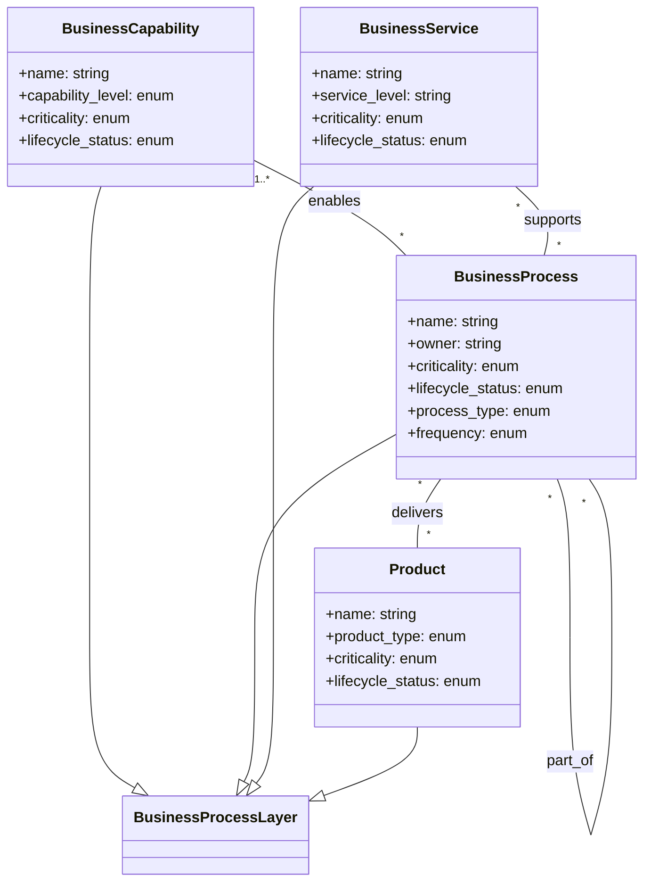

### Layer 2: Application Layer

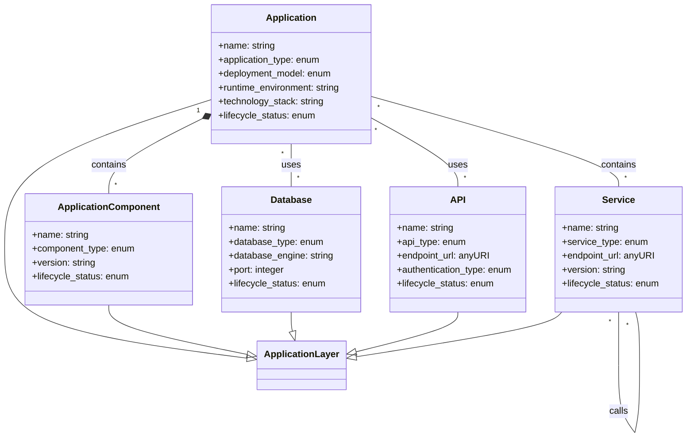

### Layer 3: Container and Orchestration Layer

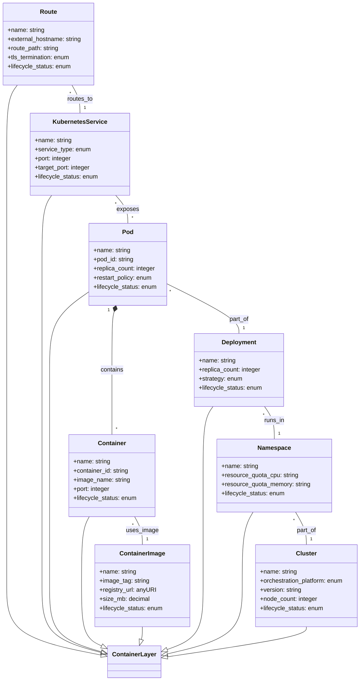

### Layer 4: Physical Infrastructure Layer

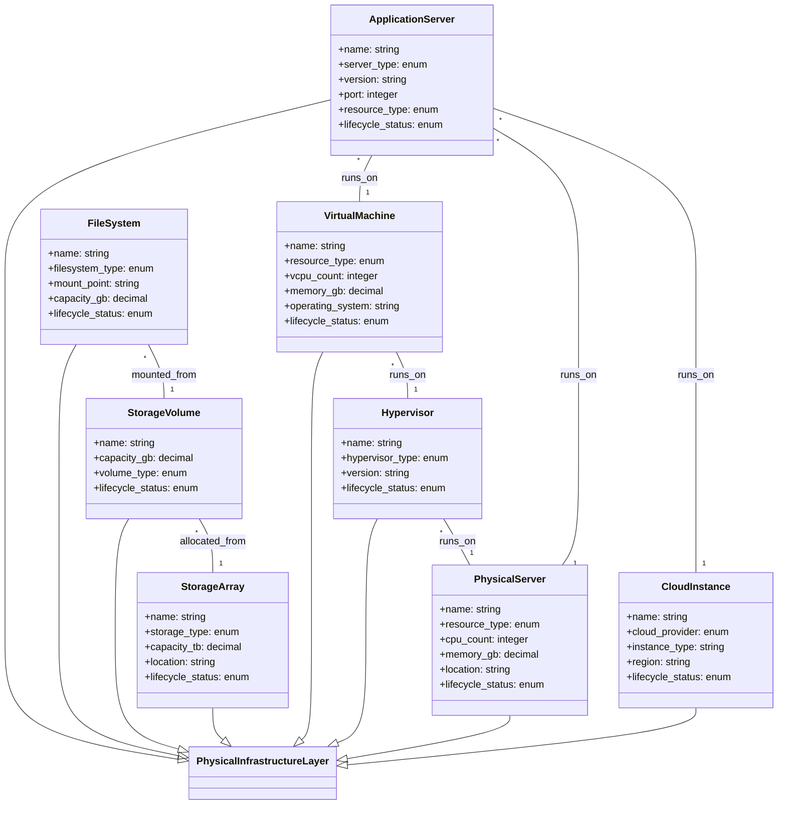

### Layer 5: Network Topology Layer

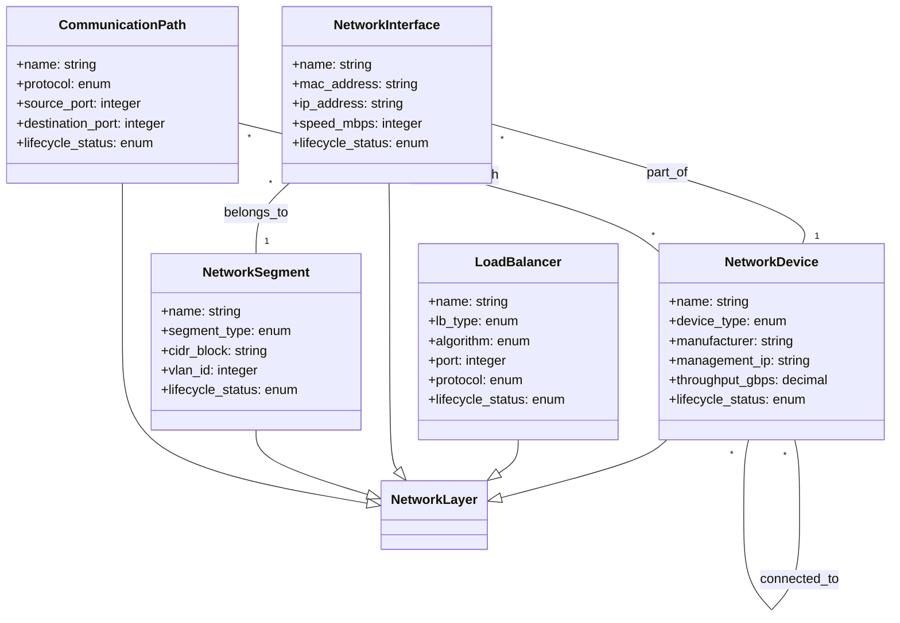

### Layer 6: Security Infrastructure Layer


---

## Cross-Layer Relationship Diagrams

### Full Stack Decomposition: Business to Infrastructure

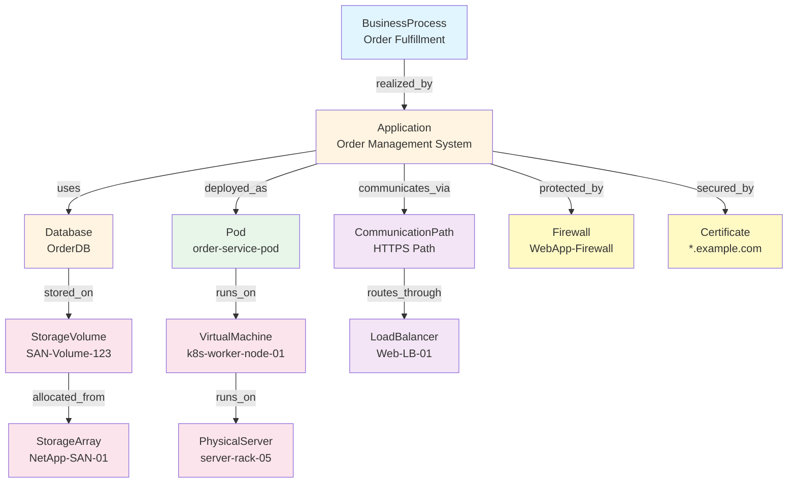

### Containerized Application Deployment Pattern

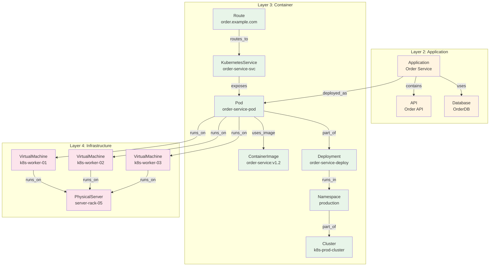

### Legacy Application Deployment Pattern

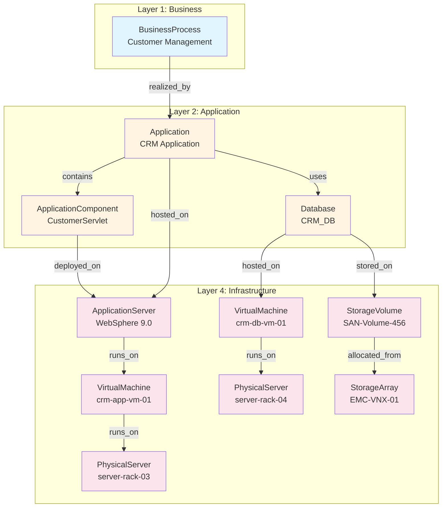

### Microservices Architecture with Service Mesh

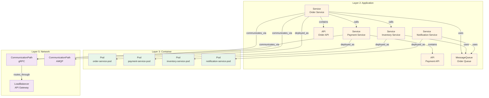

---

## Deployment Pattern Diagrams

### Pattern 1: On-Premises Infrastructure

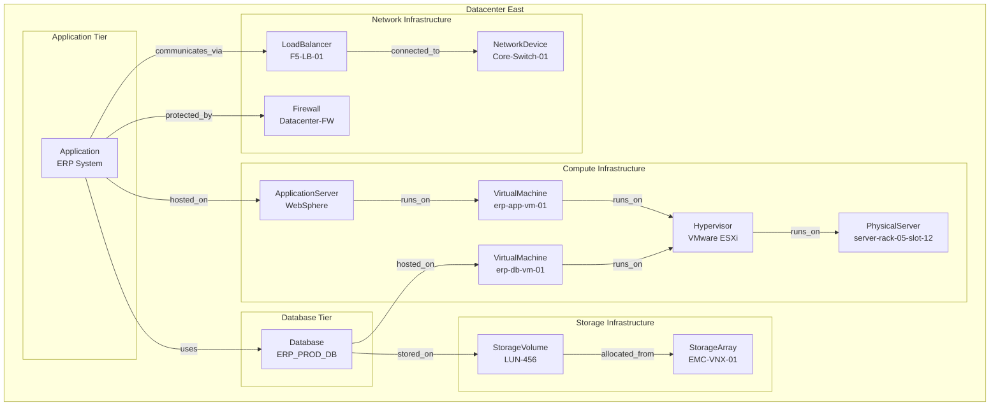

### Pattern 2: Cloud-Native Architecture (AWS)

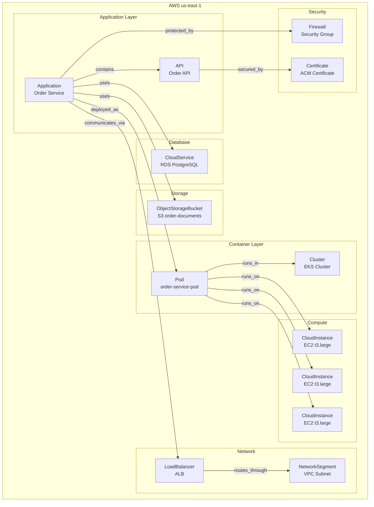

### Pattern 3: Hybrid Cloud Architecture

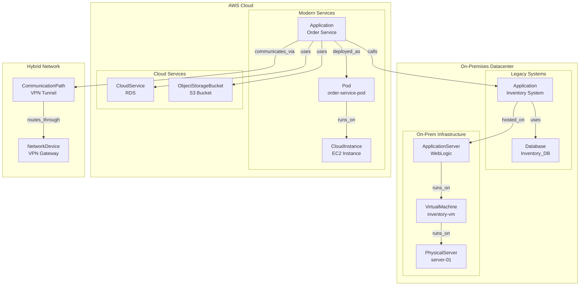

### Pattern 4: Multi-Cloud Architecture

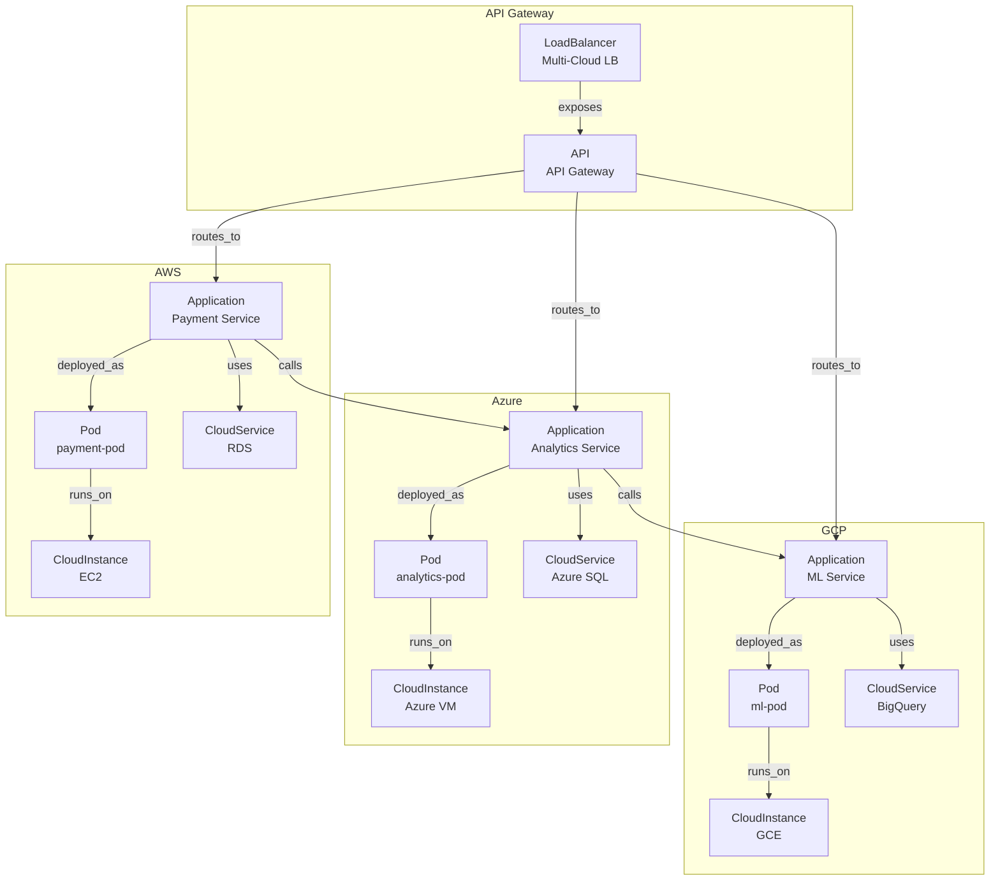

---

## Class Hierarchy Diagrams

### Complete Class Hierarchy

```mermaid
classDiagram
    class InfrastructureEntity {
        <<abstract>>
        +name: string
        +description: string
        +lifecycle_status: enum
    }
    
    class BusinessProcessLayer {
        <<abstract>>
    }
    
    class ApplicationLayer {
        <<abstract>>
    }
    
    class ContainerLayer {
        <<abstract>>
    }
    
    class PhysicalInfrastructureLayer {
        <<abstract>>
    }
    
    class NetworkLayer {
        <<abstract>>
    }
    
    class SecurityLayer {
        <<abstract>>
    }
    
    InfrastructureEntity <|-- BusinessProcessLayer
    InfrastructureEntity <|-- ApplicationLayer
    InfrastructureEntity <|-- ContainerLayer
    InfrastructureEntity <|-- PhysicalInfrastructureLayer
    InfrastructureEntity <|-- NetworkLayer
    InfrastructureEntity <|-- SecurityLayer
    
    BusinessProcessLayer <|-- BusinessProcess
    BusinessProcessLayer <|-- BusinessCapability
    BusinessProcessLayer <|-- BusinessService
    BusinessProcessLayer <|-- Product
    
    ApplicationLayer <|-- Application
    ApplicationLayer <|-- ApplicationComponent
    ApplicationLayer <|-- Service
    ApplicationLayer <|-- API
    ApplicationLayer <|-- Database
    ApplicationLayer <|-- DatabaseInstance
    ApplicationLayer <|-- DataObject
    ApplicationLayer <|-- MessageQueue
    ApplicationLayer <|-- CacheService
    ApplicationLayer <|-- FileStorageService
    ApplicationLayer <|-- ObjectStorageService
    
    ContainerLayer <|-- Container
    ContainerLayer <|-- Pod
    ContainerLayer <|-- ContainerImage
    ContainerLayer <|-- Cluster
    ContainerLayer <|-- Namespace
    ContainerLayer <|-- Deployment
    ContainerLayer <|-- KubernetesService
    ContainerLayer <|-- Route
    ContainerLayer <|-- IngressController
    
    PhysicalInfrastructureLayer <|-- PhysicalServer
    PhysicalInfrastructureLayer <|-- VirtualMachine
    PhysicalInfrastructureLayer <|-- Hypervisor
    PhysicalInfrastructureLayer <|-- ApplicationServer
    PhysicalInfrastructureLayer <|-- CloudInstance
    PhysicalInfrastructureLayer <|-- CloudService
    PhysicalInfrastructureLayer <|-- StorageArray
    PhysicalInfrastructureLayer <|-- StorageVolume
    PhysicalInfrastructureLayer <|-- FileSystem
    PhysicalInfrastructureLayer <|-- StoragePool
    PhysicalInfrastructureLayer <|-- CloudStorageService
    PhysicalInfrastructureLayer <|-- ObjectStorageBucket
    
    NetworkLayer <|-- NetworkDevice
    NetworkLayer <|-- LoadBalancer
    NetworkLayer <|-- NetworkInterface
    NetworkLayer <|-- NetworkSegment
    NetworkLayer <|-- CommunicationPath
    NetworkLayer <|-- NetworkRoute
    
    SecurityLayer <|-- Firewall
    SecurityLayer <|-- WAF
    SecurityLayer <|-- Certificate
    SecurityLayer <|-- CertificateAuthority
    SecurityLayer <|-- SecurityPolicy
    SecurityLayer <|-- IdentityProvider
    SecurityLayer <|-- SecurityZone
```

### Relationship Type Hierarchy

```mermaid
graph TD
    OP[owl:ObjectProperty<br/>Relationships]
    
    OP --> INTRA[Intra-Layer<br/>Relationships]
    OP --> CROSS[Cross-Layer<br/>Relationships]
    
    INTRA --> COMP[Composition]
    INTRA --> ENABLE[Enablement]
    INTRA --> SUPPORT[Support]
    INTRA --> CONNECT[Connectivity]
    INTRA --> ISSUE[Issuance]
    
    COMP --> PO[part_of]
    COMP --> CONT[contains]
    
    ENABLE --> EN[enables]
    ENABLE --> EB[enabled_by]
    
    SUPPORT --> SUP[supports]
    SUPPORT --> SB[supported_by]
    
    CONNECT --> CT[connected_to]
    
    ISSUE --> IB[issued_by]
    ISSUE --> ISS[issues]
    
    CROSS --> REAL[Realization]
    CROSS --> DEPLOY[Deployment]
    CROSS --> HOST[Hosting]
    CROSS --> USE[Usage]
    CROSS --> COMM[Communication]
    CROSS --> SEC[Security]
    CROSS --> STOR[Storage]
    
    REAL --> RB[realized_by]
    REAL --> REQ[requires]
    
    DEPLOY --> DA[deployed_as]
    DEPLOY --> PI[packaged_in]
    
    HOST --> RO[runs_on]
    HOST --> HO[hosted_on]
    HOST --> H[hosts]
    
    USE --> U[uses]
    USE --> C[calls]
    
    COMM --> CV[communicates_via]
    COMM --> RT[routes_through]
    
    SEC --> PB[protected_by]
    SEC --> SBY[secured_by]
    
    STOR --> SO[stored_on]
    STOR --> SI[stored_in]
    STOR --> AF[allocated_from]
    STOR --> MF[mounted_from]
    
    style OP fill:#e1f5ff
    style INTRA fill:#fff4e1
    style CROSS fill:#e8f5e9
```

### Data Property Hierarchy

```mermaid
graph TD
    DP[owl:DatatypeProperty<br/>Attributes]
    
    DP --> COMMON[Common<br/>Attributes]
    DP --> L1[Layer 1<br/>Attributes]
    DP --> L2[Layer 2<br/>Attributes]
    DP --> L3[Layer 3<br/>Attributes]
    DP --> L4[Layer 4<br/>Attributes]
    DP --> L5[Layer 5<br/>Attributes]
    DP --> L6[Layer 6<br/>Attributes]
    
    COMMON --> NAME[name]
    COMMON --> DESC[description]
    COMMON --> OWNER[owner]
    COMMON --> CRIT[criticality]
    COMMON --> LS[lifecycle_status]
    COMMON --> VER[version]
    COMMON --> LOC[location]
    
    L1 --> PT[process_type]
    L1 --> FREQ[frequency]
    L1 --> MAT[maturity_level]
    L1 --> CAP[capability_level]
    
    L2 --> AT[application_type]
    L2 --> DM[deployment_model]
    L2 --> RE[runtime_environment]
    L2 --> TS[technology_stack]
    L2 --> DC[data_classification]
    L2 --> DBT[database_type]
    L2 --> APITY[api_type]
    
    L3 --> IMG[image_name]
    L3 --> OP[orchestration_platform]
    L3 --> RC[replica_count]
    L3 --> RL[resource_limits]
    L3 --> TLS[tls_termination]
    
    L4 --> RT[resource_type]
    L4 --> CPU[cpu_count/vcpu_count]
    L4 --> MEM[memory_gb]
    L4 --> OS[operating_system]
    L4 --> CP[cloud_provider]
    L4 --> CAP4[capacity_gb/capacity_tb]
    
    L5 --> DT[device_type]
    L5 --> IP[ip_address]
    L5 --> MAC[mac_address]
    L5 --> CIDR[cidr_block]
    L5 --> PROTO[protocol]
    L5 --> BW[bandwidth_mbps]
    
    L6 --> ST[security_type]
    L6 --> FT[firewall_type]
    L6 --> CT[certificate_type]
    L6 --> VF[valid_from]
    L6 --> VT[valid_to]
    L6 --> TL[trust_level]
    
    style DP fill:#e1f5ff
    style COMMON fill:#fff4e1
    style L1 fill:#e8f5e9
    style L2 fill:#fce4ec
    style L3 fill:#f3e5f5
    style L4 fill:#fff9c4
    style L5 fill:#e1f5ff
    style L6 fill:#fff4e1
```

---

## Intra-Layer Relationship Diagrams

This section shows the internal relationships within each layer, highlighting how entities within the same layer connect to each other.

### Layer 1: Business Process Layer - Internal Relationships

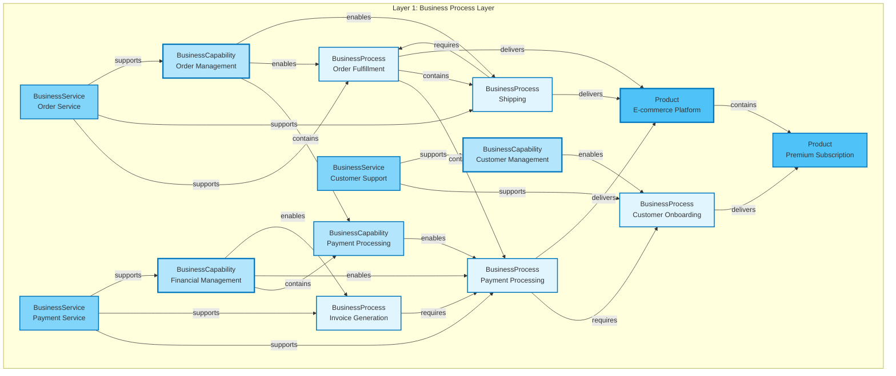

### Layer 2: Application Layer - Internal Relationships

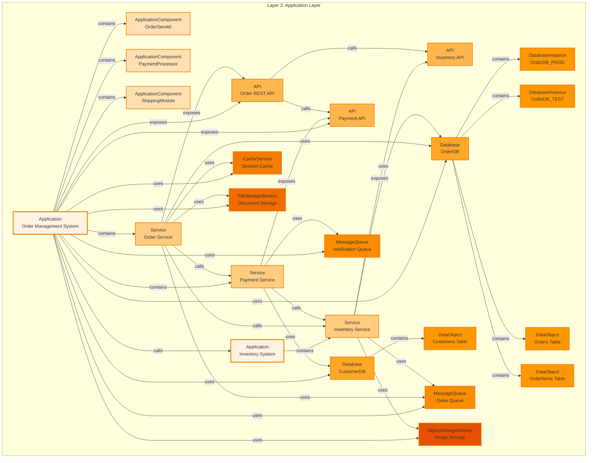

### Layer 3: Container Layer - Internal Relationships

```mermaid
graph TB
    subgraph "Layer 3: Container and Orchestration Layer"
        CL[Cluster<br/>Production Cluster]
        
        NS1[Namespace<br/>production]
        NS2[Namespace<br/>staging]
        
        DEP1[Deployment<br/>order-service-deploy]
        DEP2[Deployment<br/>payment-service-deploy]
        
        POD1[Pod<br/>order-service-pod-1]
        POD2[Pod<br/>order-service-pod-2]
        POD3[Pod<br/>payment-service-pod-1]
        
        CONT1[Container<br/>order-app]
        CONT2[Container<br/>order-sidecar]
        CONT3[Container<br/>payment-app]
        
        IMG1[ContainerImage<br/>order-service:v1.2]
        IMG2[ContainerImage<br/>sidecar:latest]
        IMG3[ContainerImage<br/>payment-service:v2.0]
        
        K8S1[KubernetesService<br/>order-service-svc]
        K8S2[KubernetesService<br/>payment-service-svc]
        
        RT1[Route<br/>order.example.com]
        IG1[IngressController<br/>nginx-ingress]
    end
    
    %% Cluster contains namespaces
    CL -->|contains| NS1
    CL -->|contains| NS2
    
    %% Namespace contains deployments
    NS1 -->|contains| DEP1
    NS1 -->|contains| DEP2
    
    %% Deployment manages pods
    DEP1 -->|manages| POD1
    DEP1 -->|manages| POD2
    DEP2 -->|manages| POD3
    
    %% Pod contains containers
    POD1 -->|contains| CONT1
    POD1 -->|contains| CONT2
    POD3 -->|contains| CONT3
    
    %% Container uses image
    CONT1 -->|uses_image| IMG1
    CONT2 -->|uses_image| IMG2
    CONT3 -->|uses_image| IMG3
    
    %% Service exposes pods
    K8S1 -->|exposes| POD1
    K8S1 -->|exposes| POD2
    K8S2 -->|exposes| POD3
    
    %% Route routes to service
    RT1 -->|routes_to| K8S1
    IG1 -->|manages| RT1
    
    style CL fill:#e8f5e9,stroke:#388e3c,stroke-width:3px
    style NS1 fill:#c8e6c9,stroke:#388e3c,stroke-width:2px
    style NS2 fill:#c8e6c9,stroke:#388e3c,stroke-width:2px
    style DEP1 fill:#a5d6a7,stroke:#388e3c,stroke-width:2px
    style DEP2 fill:#a5d6a7,stroke:#388e3c,stroke-width:2px
    style POD1 fill:#81c784,stroke:#388e3c,stroke-width:2px
    style POD2 fill:#81c784,stroke:#388e3c,stroke-width:2px
    style POD3 fill:#81c784,stroke:#388e3c,stroke-width:2px
    style CONT1 fill:#66bb6a,stroke:#388e3c,stroke-width:2px
    style CONT2 fill:#66bb6a,stroke:#388e3c,stroke-width:2px
    style CONT3 fill:#66bb6a,stroke:#388e3c,stroke-width:2px
    style IMG1 fill:#4caf50,stroke:#388e3c,stroke-width:2px
    style IMG2 fill:#4caf50,stroke:#388e3c,stroke-width:2px
    style IMG3 fill:#4caf50,stroke:#388e3c,stroke-width:2px
    style K8S1 fill:#43a047,stroke:#388e3c,stroke-width:2px
    style K8S2 fill:#43a047,stroke:#388e3c,stroke-width:2px
    style RT1 fill:#388e3c,stroke:#388e3c,stroke-width:2px
    style IG1 fill:#2e7d32,stroke:#388e3c,stroke-width:2px
```

### Layer 4: Physical Infrastructure - Internal Relationships

```mermaid
graph TB
    subgraph "Layer 4: Physical Infrastructure Layer"
        PS1[PhysicalServer<br/>server-rack-05]
        PS2[PhysicalServer<br/>server-rack-06]
        
        HV1[Hypervisor<br/>VMware ESXi]
        HV2[Hypervisor<br/>VMware ESXi]
        
        VM1[VirtualMachine<br/>app-vm-01]
        VM2[VirtualMachine<br/>app-vm-02]
        VM3[VirtualMachine<br/>db-vm-01]
        
        AS1[ApplicationServer<br/>WebSphere-01]
        AS2[ApplicationServer<br/>Tomcat-01]
        
        SA1[StorageArray<br/>NetApp SAN]
        SP1[StoragePool<br/>Production Pool]
        
        SV1[StorageVolume<br/>app-vol-01]
        SV2[StorageVolume<br/>app-vol-02]
        SV3[StorageVolume<br/>db-vol-01]
        
        FS1[FileSystem<br/>/mnt/app-data]
        FS2[FileSystem<br/>/mnt/db-data]
    end
    
    %% Hypervisor runs on physical server
    HV1 -->|runs_on| PS1
    HV2 -->|runs_on| PS2
    
    %% VMs run on hypervisor
    VM1 -->|runs_on| HV1
    VM2 -->|runs_on| HV1
    VM3 -->|runs_on| HV2
    
    %% ApplicationServer runs on VMs
    AS1 -->|runs_on| VM1
    AS2 -->|runs_on| VM2
    
    %% Storage hierarchy
    SA1 -->|contains| SP1
    SP1 -->|allocates| SV1
    SP1 -->|allocates| SV2
    SP1 -->|allocates| SV3
    
    %% Filesystem mounted from volume
    FS1 -->|mounted_from| SV1
    FS2 -->|mounted_from| SV3
    
    %% VMs use storage
    VM1 -->|uses| SV1
    VM2 -->|uses| SV2
    VM3 -->|uses| SV3
    
    style PS1 fill:#fce4ec,stroke:#c2185b,stroke-width:3px
    style PS2 fill:#fce4ec,stroke:#c2185b,stroke-width:3px
    style HV1 fill:#f8bbd0,stroke:#c2185b,stroke-width:2px
    style HV2 fill:#f8bbd0,stroke:#c2185b,stroke-width:2px
    style VM1 fill:#f48fb1,stroke:#c2185b,stroke-width:2px
    style VM2 fill:#f48fb1,stroke:#c2185b,stroke-width:2px
    style VM3 fill:#f48fb1,stroke:#c2185b,stroke-width:2px
    style AS1 fill:#f06292,stroke:#c2185b,stroke-width:2px
    style AS2 fill:#f06292,stroke:#c2185b,stroke-width:2px
    style SA1 fill:#ec407a,stroke:#c2185b,stroke-width:2px
    style SP1 fill:#e91e63,stroke:#c2185b,stroke-width:2px
    style SV1 fill:#d81b60,stroke:#c2185b,stroke-width:2px
    style SV2 fill:#d81b60,stroke:#c2185b,stroke-width:2px
    style SV3 fill:#d81b60,stroke:#c2185b,stroke-width:2px
    style FS1 fill:#c2185b,stroke:#c2185b,stroke-width:2px
    style FS2 fill:#c2185b,stroke:#c2185b,stroke-width:2px
```

### Layer 5: Network Layer - Internal Relationships

```mermaid
graph TB
    subgraph "Layer 5: Network Topology Layer"
        ND1[NetworkDevice<br/>Core Router]
        ND2[NetworkDevice<br/>Distribution Switch]
        ND3[NetworkDevice<br/>Access Switch]
        
        LB1[LoadBalancer<br/>F5 LB]
        LB2[LoadBalancer<br/>ALB]
        
        NSG1[NetworkSegment<br/>App Subnet<br/>10.1.10.0/24]
        NSG2[NetworkSegment<br/>DB Subnet<br/>10.1.20.0/24]
        NSG3[NetworkSegment<br/>DMZ<br/>10.1.1.0/24]
        
        NI1[NetworkInterface<br/>eth0 - 10.1.10.5]
        NI2[NetworkInterface<br/>eth0 - 10.1.10.6]
        NI3[NetworkInterface<br/>eth0 - 10.1.20.5]
        
        CP1[CommunicationPath<br/>HTTPS Path]
        CP2[CommunicationPath<br/>SQL Path]
        
        NR1[NetworkRoute<br/>Default Gateway]
        NR2[NetworkRoute<br/>DB Route]
    end
    
    %% Network device connections
    ND1 -->|connected_to| ND2
    ND2 -->|connected_to| ND3
    ND2 -->|connected_to| LB1
    
    %% Load balancer connections
    LB1 -->|connected_to| ND2
    LB2 -->|connected_to| ND3
    
    %% Network interfaces connected to device ports
    NI1 -->|connected_to_port| ND2
    NI2 -->|connected_to_port| ND2
    NI3 -->|connected_to_port| ND3
    
    %% Network interfaces in segments
    NI1 -->|part_of_segment| NSG1
    NI2 -->|part_of_segment| NSG1
    NI3 -->|part_of_segment| NSG2
    
    %% Communication paths connect interfaces and route through devices
    CP1 -->|connects_from| NI1
    CP1 -->|routes_through| LB1
    CP1 -->|routes_through| ND2
    CP1 -->|connects_to| NI2
    
    CP2 -->|connects_from| NI2
    CP2 -->|routes_through| ND2
    CP2 -->|routes_through| ND3
    CP2 -->|connects_to| NI3
    
    %% Routes apply to segments
    NR1 -->|applies_to| NSG1
    NR1 -->|applies_to| NSG2
    NR2 -->|applies_to| NSG2
    
    style ND1 fill:#f3e5f5,stroke:#7b1fa2,stroke-width:3px
    style ND2 fill:#f3e5f5,stroke:#7b1fa2,stroke-width:2px
    style ND3 fill:#f3e5f5,stroke:#7b1fa2,stroke-width:2px
    style LB1 fill:#e1bee7,stroke:#7b1fa2,stroke-width:2px
    style LB2 fill:#e1bee7,stroke:#7b1fa2,stroke-width:2px
    style NSG1 fill:#ce93d8,stroke:#7b1fa2,stroke-width:2px
    style NSG2 fill:#ce93d8,stroke:#7b1fa2,stroke-width:2px
    style NSG3 fill:#ce93d8,stroke:#7b1fa2,stroke-width:2px
    style NI1 fill:#ba68c8,stroke:#7b1fa2,stroke-width:2px
    style NI2 fill:#ba68c8,stroke:#7b1fa2,stroke-width:2px
    style NI3 fill:#ba68c8,stroke:#7b1fa2,stroke-width:2px
    style CP1 fill:#ab47bc,stroke:#7b1fa2,stroke-width:2px
    style CP2 fill:#ab47bc,stroke:#7b1fa2,stroke-width:2px
    style NR1 fill:#9c27b0,stroke:#7b1fa2,stroke-width:2px
    style NR2 fill:#9c27b0,stroke:#7b1fa2,stroke-width:2px
```

### Layer 6: Security Layer - Internal Relationships

```mermaid
graph TB
    subgraph "Layer 6: Security Infrastructure Layer"
        CA1[CertificateAuthority<br/>Root CA]
        CA2[CertificateAuthority<br/>Intermediate CA]
        
        CERT1[Certificate<br/>*.example.com]
        CERT2[Certificate<br/>api.example.com]
        CERT3[Certificate<br/>db.example.com]
        
        FW1[Firewall<br/>Perimeter Firewall]
        FW2[Firewall<br/>Internal Firewall]
        WAF1[WAF<br/>Web Application Firewall]
        
        SP1[SecurityPolicy<br/>Network Access Policy]
        SP2[SecurityPolicy<br/>Data Protection Policy]
        SP3[SecurityPolicy<br/>Encryption Policy]
        
        IDP1[IdentityProvider<br/>Azure AD]
        
        SZ1[SecurityZone<br/>DMZ]
        SZ2[SecurityZone<br/>Internal]
        SZ3[SecurityZone<br/>Restricted]
    end
    
    %% CA hierarchy
    CA2 -->|trusts| CA1
    
    %% Certificates issued by CA
    CERT1 -->|issued_by| CA2
    CERT2 -->|issued_by| CA2
    CERT3 -->|issued_by| CA2
    
    %% Firewalls enforce policies
    FW1 -->|enforces| SP1
    FW2 -->|enforces| SP1
    FW2 -->|enforces| SP2
    WAF1 -->|enforces| SP3
    
    %% Firewalls protect zones
    FW1 -->|protects| SZ1
    FW2 -->|protects| SZ2
    FW2 -->|protects| SZ3
    
    %% IDP enforces policies
    IDP1 -->|enforces| SP1
    IDP1 -->|uses_certificate| CERT1
    
    %% Security zones have policies
    SZ1 -->|governed_by| SP1
    SZ2 -->|governed_by| SP2
    SZ3 -->|governed_by| SP2
    SZ3 -->|governed_by| SP3
    
    style CA1 fill:#fff9c4,stroke:#f57f17,stroke-width:3px
    style CA2 fill:#fff59d,stroke:#f57f17,stroke-width:2px
    style CERT1 fill:#fff176,stroke:#f57f17,stroke-width:2px
    style CERT2 fill:#fff176,stroke:#f57f17,stroke-width:2px
    style CERT3 fill:#fff176,stroke:#f57f17,stroke-width:2px
    style FW1 fill:#ffee58,stroke:#f57f17,stroke-width:2px
    style FW2 fill:#ffee58,stroke:#f57f17,stroke-width:2px
    style WAF1 fill:#ffeb3b,stroke:#f57f17,stroke-width:2px
    style SP1 fill:#fdd835,stroke:#f57f17,stroke-width:2px
    style SP2 fill:#fdd835,stroke:#f57f17,stroke-width:2px
    style SP3 fill:#fdd835,stroke:#f57f17,stroke-width:2px
    style IDP1 fill:#fbc02d,stroke:#f57f17,stroke-width:2px
    style SZ1 fill:#f9a825,stroke:#f57f17,stroke-width:2px
    style SZ2 fill:#f9a825,stroke:#f57f17,stroke-width:2px
    style SZ3 fill:#f9a825,stroke:#f57f17,stroke-width:2px
```

---

## Component Relationship Diagrams

This section provides detailed relationship diagrams for each major component, showing all connections to neighboring components across layers.

### Application Component Relationships

```mermaid
graph TB
    subgraph "Layer 1: Business"
        BP[BusinessProcess]
        BC[BusinessCapability]
        BS[BusinessService]
        P[Product]
    end
    
    subgraph "Layer 2: Application - Focus"
        APP[Application<br/><b>FOCUS COMPONENT</b>]
        AC[ApplicationComponent]
        SVC[Service]
        API[API]
        DB[Database]
        MQ[MessageQueue]
        CACHE[CacheService]
    end
    
    subgraph "Layer 3: Container"
        POD[Pod]
        CONT[Container]
    end
    
    subgraph "Layer 4: Infrastructure"
        AS[ApplicationServer]
        VM[VirtualMachine]
        CI[CloudInstance]
    end
    
    subgraph "Layer 5: Network"
        CP[CommunicationPath]
        LB[LoadBalancer]
    end
    
    subgraph "Layer 6: Security"
        FW[Firewall]
        WAF[WAF]
        CERT[Certificate]
        IDP[IdentityProvider]
        SZ[SecurityZone]
    end
    
    %% Upward relationships (to Business)
    BP -->|realized_by| APP
    BC -->|realized_by| APP
    BS -->|realized_by| APP
    P -->|requires| APP
    
    %% Intra-layer relationships
    APP -->|contains| AC
    APP -->|contains| SVC
    APP -->|exposes| API
    APP -->|uses| DB
    APP -->|uses| MQ
    APP -->|uses| CACHE
    SVC -->|calls| SVC
    
    %% Downward relationships (to Container)
    APP -->|deployed_as| POD
    APP -->|packaged_in| CONT
    
    %% Downward relationships (to Infrastructure)
    APP -->|hosted_on| AS
    APP -->|hosted_on| VM
    APP -->|hosted_on| CI
    
    %% Cross-layer (to Network)
    APP -->|communicates_via| CP
    APP -->|exposes_via| LB
    
    %% Cross-layer (to Security)
    APP -->|protected_by| FW
    APP -->|protected_by| WAF
    APP -->|uses_certificate| CERT
    APP -->|authenticated_by| IDP
    APP -->|belongs_to_zone| SZ
    
    style APP fill:#ffeb3b,stroke:#f57c00,stroke-width:4px
    style BP fill:#e1f5ff
    style BC fill:#e1f5ff
    style BS fill:#e1f5ff
    style P fill:#e1f5ff
    style AC fill:#fff4e1
    style SVC fill:#fff4e1
    style API fill:#fff4e1
    style DB fill:#fff4e1
    style MQ fill:#fff4e1
    style CACHE fill:#fff4e1
    style POD fill:#e8f5e9
    style CONT fill:#e8f5e9
    style AS fill:#fce4ec
    style VM fill:#fce4ec
    style CI fill:#fce4ec
    style CP fill:#f3e5f5
    style LB fill:#f3e5f5
    style FW fill:#fff9c4
    style WAF fill:#fff9c4
    style CERT fill:#fff9c4
    style IDP fill:#fff9c4
    style SZ fill:#fff9c4
```

### ApplicationServer Component Relationships

```mermaid
graph TB
    subgraph "Layer 2: Application"
        APP[Application]
        AC[ApplicationComponent]
        DB[Database]
    end
    
    subgraph "Layer 4: Infrastructure - Focus"
        AS[ApplicationServer<br/><b>FOCUS COMPONENT</b>]
        VM[VirtualMachine]
        PS[PhysicalServer]
        CI[CloudInstance]
        HV[Hypervisor]
    end
    
    subgraph "Layer 5: Network"
        NI[NetworkInterface]
        NSG[NetworkSegment]
        LB[LoadBalancer]
    end
    
    subgraph "Layer 6: Security"
        FW[Firewall]
        CERT[Certificate]
        SP[SecurityPolicy]
    end
    
    %% Upward relationships (from Application)
    APP -->|hosted_on| AS
    AC -->|deployed_on| AS
    
    %% Intra-layer relationships (Infrastructure)
    AS -->|runs_on| VM
    AS -->|runs_on| PS
    AS -->|runs_on| CI
    VM -->|runs_on| HV
    HV -->|runs_on| PS
    
    %% Cross-layer (to Network)
    AS -->|has_interface| NI
    NI -->|part_of_segment| NSG
    AS -->|balanced_by| LB
    
    %% Cross-layer (to Security)
    AS -->|protected_by| FW
    AS -->|uses_certificate| CERT
    AS -->|secured_by| SP
    
    style AS fill:#ffeb3b,stroke:#f57c00,stroke-width:4px
    style APP fill:#fff4e1
    style AC fill:#fff4e1
    style DB fill:#fff4e1
    style VM fill:#fce4ec
    style PS fill:#fce4ec
    style CI fill:#fce4ec
    style HV fill:#fce4ec
    style NI fill:#f3e5f5
    style NSG fill:#f3e5f5
    style LB fill:#f3e5f5
    style FW fill:#fff9c4
    style CERT fill:#fff9c4
    style SP fill:#fff9c4
```

### Database Component Relationships

```mermaid
graph TB
    subgraph "Layer 2: Application - Focus"
        DB[Database<br/><b>FOCUS COMPONENT</b>]
        DBI[DatabaseInstance]
        DO[DataObject]
        APP[Application]
        SVC[Service]
    end
    
    subgraph "Layer 4: Infrastructure"
        VM[VirtualMachine]
        CI[CloudInstance]
        CS[CloudService]
        SV[StorageVolume]
        FS[FileSystem]
        CSS[CloudStorageService]
    end
    
    subgraph "Layer 5: Network"
        CP[CommunicationPath]
        NSG[NetworkSegment]
        NI[NetworkInterface]
    end
    
    subgraph "Layer 6: Security"
        FW[Firewall]
        SP[SecurityPolicy]
        SZ[SecurityZone]
    end
    
    %% Intra-layer relationships
    DB -->|contains| DBI
    DB -->|contains| DO
    APP -->|uses| DB
    SVC -->|uses| DB
    
    %% Downward relationships (to Infrastructure)
    DB -->|hosted_on| VM
    DB -->|hosted_on| CI
    DB -->|hosted_on| CS
    DB -->|stored_on| SV
    DB -->|stored_on| FS
    DB -->|stored_on| CSS
    
    %% Cross-layer (to Network)
    DB -->|communicates_via| CP
    DB -->|has_interface| NI
    NI -->|part_of_segment| NSG
    
    %% Cross-layer (to Security)
    DB -->|protected_by| FW
    DB -->|secured_by| SP
    DB -->|belongs_to_zone| SZ
    
    style DB fill:#ffeb3b,stroke:#f57c00,stroke-width:4px
    style DBI fill:#fff4e1
    style DO fill:#fff4e1
    style APP fill:#fff4e1
    style SVC fill:#fff4e1
    style VM fill:#fce4ec
    style CI fill:#fce4ec
    style CS fill:#fce4ec
    style SV fill:#fce4ec
    style FS fill:#fce4ec
    style CSS fill:#fce4ec
    style CP fill:#f3e5f5
    style NSG fill:#f3e5f5
    style NI fill:#f3e5f5
    style FW fill:#fff9c4
    style SP fill:#fff9c4
    style SZ fill:#fff9c4
```

### Container/Pod Component Relationships

```mermaid
graph TB
    subgraph "Layer 2: Application"
        APP[Application]
        SVC[Service]
    end
    
    subgraph "Layer 3: Container - Focus"
        POD[Pod<br/><b>FOCUS COMPONENT</b>]
        CONT[Container]
        IMG[ContainerImage]
        DEP[Deployment]
        K8S[KubernetesService]
        RT[Route]
        NS[Namespace]
        CL[Cluster]
    end
    
    subgraph "Layer 4: Infrastructure"
        VM[VirtualMachine]
        CI[CloudInstance]
        PS[PhysicalServer]
        SV[StorageVolume]
    end
    
    subgraph "Layer 5: Network"
        LB[LoadBalancer]
        NI[NetworkInterface]
        NSG[NetworkSegment]
    end
    
    subgraph "Layer 6: Security"
        FW[Firewall]
        SP[SecurityPolicy]
        SZ[SecurityZone]
    end
    
    %% Upward relationships (from Application)
    APP -->|deployed_as| POD
    SVC -->|deployed_as| POD
    
    %% Intra-layer relationships
    POD -->|contains| CONT
    CONT -->|uses_image| IMG
    POD -->|part_of| DEP
    POD -->|runs_in| NS
    NS -->|part_of| CL
    K8S -->|exposes| POD
    RT -->|routes_to| K8S
    
    %% Downward relationships (to Infrastructure)
    POD -->|runs_on| VM
    POD -->|runs_on| CI
    VM -->|runs_on| PS
    POD -->|uses| SV
    
    %% Cross-layer (to Network)
    POD -->|balanced_by| LB
    POD -->|has_interface| NI
    NI -->|part_of_segment| NSG
    
    %% Cross-layer (to Security)
    POD -->|protected_by| FW
    POD -->|secured_by| SP
    POD -->|belongs_to_zone| SZ
    
    style POD fill:#ffeb3b,stroke:#f57c00,stroke-width:4px
    style APP fill:#fff4e1
    style SVC fill:#fff4e1
    style CONT fill:#e8f5e9
    style IMG fill:#e8f5e9
    style DEP fill:#e8f5e9
    style K8S fill:#e8f5e9
    style RT fill:#e8f5e9
    style NS fill:#e8f5e9
    style CL fill:#e8f5e9
    style VM fill:#fce4ec
    style CI fill:#fce4ec
    style PS fill:#fce4ec
    style SV fill:#fce4ec
    style LB fill:#f3e5f5
    style NI fill:#f3e5f5
    style NSG fill:#f3e5f5
    style FW fill:#fff9c4
    style SP fill:#fff9c4
    style SZ fill:#fff9c4
```

### VirtualMachine Component Relationships

```mermaid
graph TB
    subgraph "Layer 2: Application"
        APP[Application]
        DB[Database]
    end
    
    subgraph "Layer 3: Container"
        POD[Pod]
        CL[Cluster]
    end
    
    subgraph "Layer 4: Infrastructure - Focus"
        VM[VirtualMachine<br/><b>FOCUS COMPONENT</b>]
        AS[ApplicationServer]
        HV[Hypervisor]
        PS[PhysicalServer]
        SV[StorageVolume]
        FS[FileSystem]
    end
    
    subgraph "Layer 5: Network"
        NI[NetworkInterface]
        NSG[NetworkSegment]
        LB[LoadBalancer]
    end
    
    subgraph "Layer 6: Security"
        FW[Firewall]
        SP[SecurityPolicy]
        SZ[SecurityZone]
    end
    
    %% Upward relationships (from Application & Container)
    APP -->|hosted_on| VM
    DB -->|hosted_on| VM
    POD -->|runs_on| VM
    AS -->|runs_on| VM
    CL -->|uses| VM
    
    %% Intra-layer relationships
    VM -->|runs_on| HV
    HV -->|runs_on| PS
    VM -->|uses| SV
    VM -->|uses| FS
    
    %% Cross-layer (to Network)
    VM -->|has_interface| NI
    NI -->|part_of_segment| NSG
    VM -->|balanced_by| LB
    
    %% Cross-layer (to Security)
    VM -->|protected_by| FW
    VM -->|secured_by| SP
    VM -->|belongs_to_zone| SZ
    
    style VM fill:#ffeb3b,stroke:#f57c00,stroke-width:4px
    style APP fill:#fff4e1
    style DB fill:#fff4e1
    style POD fill:#e8f5e9
    style CL fill:#e8f5e9
    style AS fill:#fce4ec
    style HV fill:#fce4ec
    style PS fill:#fce4ec
    style SV fill:#fce4ec
    style FS fill:#fce4ec
    style NI fill:#f3e5f5
    style NSG fill:#f3e5f5
    style LB fill:#f3e5f5
    style FW fill:#fff9c4
    style SP fill:#fff9c4
    style SZ fill:#fff9c4
```

### LoadBalancer Component Relationships

```mermaid
graph TB
    subgraph "Layer 2: Application"
        APP[Application]
        SVC[Service]
        API[API]
    end
    
    subgraph "Layer 3: Container"
        POD[Pod]
        K8S[KubernetesService]
        RT[Route]
    end
    
    subgraph "Layer 4: Infrastructure"
        VM[VirtualMachine]
        CI[CloudInstance]
        AS[ApplicationServer]
    end
    
    subgraph "Layer 5: Network - Focus"
        LB[LoadBalancer<br/><b>FOCUS COMPONENT</b>]
        ND[NetworkDevice]
        NSG[NetworkSegment]
        CP[CommunicationPath]
        NI[NetworkInterface]
    end
    
    subgraph "Layer 6: Security"
        FW[Firewall]
        CERT[Certificate]
        SP[SecurityPolicy]
    end
    
    %% Upward relationships (from Application & Container)
    APP -->|exposes_via| LB
    SVC -->|exposes_via| LB
    API -->|exposes_via| LB
    RT -->|routes_to| LB
    
    %% Intra-layer relationships
    LB -->|connected_to| ND
    LB -->|part_of_segment| NSG
    CP -->|routes_through| LB
    LB -->|has_interface| NI
    NI -->|source_of| CP
    NI -->|destination_of| CP
    
    %% Downward relationships (to Infrastructure)
    LB -->|balances_to| VM
    LB -->|balances_to| CI
    LB -->|balances_to| AS
    LB -->|balances_to| POD
    
    %% Cross-layer (to Security)
    LB -->|protected_by| FW
    LB -->|uses_certificate| CERT
    LB -->|secured_by| SP
    
    style LB fill:#ffeb3b,stroke:#f57c00,stroke-width:4px
    style APP fill:#fff4e1
    style SVC fill:#fff4e1
    style API fill:#fff4e1
    style POD fill:#e8f5e9
    style K8S fill:#e8f5e9
    style RT fill:#e8f5e9
    style VM fill:#fce4ec
    style CI fill:#fce4ec
    style AS fill:#fce4ec
    style ND fill:#f3e5f5
    style NSG fill:#f3e5f5
    style CP fill:#f3e5f5
    style NI fill:#f3e5f5
    style FW fill:#fff9c4
    style CERT fill:#fff9c4
    style SP fill:#fff9c4
```

### CommunicationPath Component Relationships

```mermaid
graph TB
    subgraph "Layer 2: Application"
        APP[Application]
        SVC[Service]
        DB[Database]
    end
    
    subgraph "Layer 4: Infrastructure"
        VM1[VirtualMachine<br/>Source]
        VM2[VirtualMachine<br/>Destination]
    end
    
    subgraph "Layer 5: Network - Focus"
        CP[CommunicationPath<br/><b>FOCUS COMPONENT</b>]
        NI_SRC[NetworkInterface<br/>Source eth0]
        NI_DST[NetworkInterface<br/>Destination eth0]
        ND1[NetworkDevice<br/>Router]
        ND2[NetworkDevice<br/>Firewall]
        ND3[NetworkDevice<br/>Switch]
        LB[LoadBalancer]
        NSG1[NetworkSegment<br/>Source Subnet]
        NSG2[NetworkSegment<br/>Destination Subnet]
    end
    
    subgraph "Layer 6: Security"
        FW[Firewall]
        CERT[Certificate]
    end
    
    %% Upward relationships (from Application)
    APP -->|communicates_via| CP
    SVC -->|communicates_via| CP
    
    %% Intra-layer relationships - ENDPOINTS
    CP -->|connects_from| NI_SRC
    CP -->|connects_to| NI_DST
    NI_SRC -->|source_of| CP
    NI_DST -->|destination_of| CP
    
    %% Intra-layer relationships - ROUTING
    CP -->|routes_through| ND1
    CP -->|routes_through| ND2
    CP -->|routes_through| ND3
    CP -->|routes_through| LB
    
    %% Network interface relationships
    NI_SRC -->|attached_to| VM1
    NI_DST -->|attached_to| VM2
    NI_SRC -->|part_of_segment| NSG1
    NI_DST -->|part_of_segment| NSG2
    
    %% Cross-layer (to Security)
    CP -->|protected_by| FW
    CP -->|secured_by| CERT
    
    style CP fill:#ffeb3b,stroke:#f57c00,stroke-width:4px
    style NI_SRC fill:#ab47bc,stroke:#7b1fa2,stroke-width:3px
    style NI_DST fill:#ab47bc,stroke:#7b1fa2,stroke-width:3px
    style APP fill:#fff4e1
    style SVC fill:#fff4e1
    style DB fill:#fff4e1
    style VM1 fill:#fce4ec
    style VM2 fill:#fce4ec
    style ND1 fill:#f3e5f5
    style ND2 fill:#f3e5f5
    style ND3 fill:#f3e5f5
    style LB fill:#f3e5f5
    style NSG1 fill:#f3e5f5
    style NSG2 fill:#f3e5f5
    style FW fill:#fff9c4
    style CERT fill:#fff9c4
```

### Certificate Component Relationships

```mermaid
graph TB
    subgraph "Layer 2: Application"
        APP[Application]
        API[API]
        SVC[Service]
    end
    
    subgraph "Layer 3: Container"
        RT[Route]
        IG[IngressController]
    end
    
    subgraph "Layer 4: Infrastructure"
        AS[ApplicationServer]
    end
    
    subgraph "Layer 5: Network"
        LB[LoadBalancer]
    end
    
    subgraph "Layer 6: Security - Focus"
        CERT[Certificate<br/><b>FOCUS COMPONENT</b>]
        CA[CertificateAuthority]
        SP[SecurityPolicy]
        IDP[IdentityProvider]
    end
    
    %% Upward relationships (from all layers)
    APP -->|uses_certificate| CERT
    API -->|uses_certificate| CERT
    SVC -->|uses_certificate| CERT
    RT -->|uses_certificate| CERT
    IG -->|uses_certificate| CERT
    AS -->|uses_certificate| CERT
    LB -->|uses_certificate| CERT
    
    %% Intra-layer relationships
    CERT -->|issued_by| CA
    CA -->|trusts| CA
    CERT -->|governed_by| SP
    IDP -->|uses_certificate| CERT
    
    style CERT fill:#ffeb3b,stroke:#f57c00,stroke-width:4px
    style APP fill:#fff4e1
    style API fill:#fff4e1
    style SVC fill:#fff4e1
    style RT fill:#e8f5e9
    style IG fill:#e8f5e9
    style AS fill:#fce4ec
    style LB fill:#f3e5f5
    style CA fill:#fff9c4
    style SP fill:#fff9c4
    style IDP fill:#fff9c4
```

### StorageVolume Component Relationships

```mermaid
graph TB
    subgraph "Layer 2: Application"
        DB[Database]
        FS_APP[FileStorageService]
    end
    
    subgraph "Layer 3: Container"
        POD[Pod]
        CONT[Container]
    end
    
    subgraph "Layer 4: Infrastructure - Focus"
        SV[StorageVolume<br/><b>FOCUS COMPONENT</b>]
        SA[StorageArray]
        SP_STOR[StoragePool]
        FS[FileSystem]
        VM[VirtualMachine]
        PS[PhysicalServer]
    end
    
    subgraph "Layer 5: Network"
        NSG[NetworkSegment]
        CP[CommunicationPath]
    end
    
    subgraph "Layer 6: Security"
        FW[Firewall]
        SP_SEC[SecurityPolicy]
        SZ[SecurityZone]
    end
    
    %% Upward relationships (from Application & Container)
    DB -->|stored_on| SV
    FS_APP -->|uses| SV
    POD -->|uses| SV
    CONT -->|uses| SV
    
    %% Intra-layer relationships
    SV -->|allocated_from| SA
    SV -->|allocated_from| SP_STOR
    FS -->|mounted_from| SV
    SV -->|attached_to| VM
    SV -->|attached_to| PS
    
    %% Cross-layer (to Network)
    SV -->|accessed_via| NSG
    SV -->|accessed_via| CP
    
    %% Cross-layer (to Security)
    SV -->|protected_by| FW
    SV -->|secured_by| SP_SEC
    SV -->|belongs_to_zone| SZ
    
    style SV fill:#ffeb3b,stroke:#f57c00,stroke-width:4px
    style DB fill:#fff4e1
    style FS_APP fill:#fff4e1
    style POD fill:#e8f5e9
    style CONT fill:#e8f5e9
    style SA fill:#fce4ec
    style SP_STOR fill:#fce4ec
    style FS fill:#fce4ec
    style VM fill:#fce4ec
    style PS fill:#fce4ec
    style NSG fill:#f3e5f5
    style CP fill:#f3e5f5
    style FW fill:#fff9c4
    style SP_SEC fill:#fff9c4
    style SZ fill:#fff9c4
```

### Firewall Component Relationships

```mermaid
graph TB
    subgraph "Layer 1: Business"
        BP[BusinessProcess]
    end
    
    subgraph "Layer 2: Application"
        APP[Application]
        DB[Database]
        API[API]
    end
    
    subgraph "Layer 3: Container"
        POD[Pod]
        CL[Cluster]
    end
    
    subgraph "Layer 4: Infrastructure"
        VM[VirtualMachine]
        AS[ApplicationServer]
        SV[StorageVolume]
    end
    
    subgraph "Layer 5: Network"
        ND[NetworkDevice]
        NSG[NetworkSegment]
        CP[CommunicationPath]
        LB[LoadBalancer]
    end
    
    subgraph "Layer 6: Security - Focus"
        FW[Firewall<br/><b>FOCUS COMPONENT</b>]
        SP[SecurityPolicy]
        SZ[SecurityZone]
        WAF[WAF]
    end
    
    %% Protects entities from all layers
    FW -->|protects| BP
    FW -->|protects| APP
    FW -->|protects| DB
    FW -->|protects| API
    FW -->|protects| POD
    FW -->|protects| CL
    FW -->|protects| VM
    FW -->|protects| AS
    FW -->|protects| SV
    
    %% Intra-layer relationships
    FW -->|enforces| SP
    FW -->|protects| SZ
    FW -->|works_with| WAF
    
    %% Network relationships
    FW -->|connected_to| ND
    FW -->|part_of_segment| NSG
    FW -->|filters| CP
    FW -->|protects| LB
    
    style FW fill:#ffeb3b,stroke:#f57c00,stroke-width:4px
    style BP fill:#e1f5ff
    style APP fill:#fff4e1
    style DB fill:#fff4e1
    style API fill:#fff4e1
    style POD fill:#e8f5e9
    style CL fill:#e8f5e9
    style VM fill:#fce4ec
    style AS fill:#fce4ec
    style SV fill:#fce4ec
    style ND fill:#f3e5f5
    style NSG fill:#f3e5f5
    style CP fill:#f3e5f5
    style LB fill:#f3e5f5
    style SP fill:#fff9c4
    style SZ fill:#fff9c4
    style WAF fill:#fff9c4
```

---

## Diagram Legend

### Color Coding

- **Light Blue** (#e1f5ff): Layer 1 - Business Processes
- **Light Orange** (#fff4e1): Layer 2 - Application Layer
- **Light Green** (#e8f5e9): Layer 3 - Container & Orchestration
- **Light Pink** (#fce4ec): Layer 4 - Physical Infrastructure
- **Light Purple** (#f3e5f5): Layer 5 - Network Topology
- **Light Yellow** (#fff9c4): Layer 6 - Security Infrastructure

### Relationship Arrows

- **Solid Arrow** (→): Direct relationship
- **Dashed Arrow** (⇢): Inheritance or subclass relationship
- **Bidirectional Arrow** (↔): Symmetric relationship

### Node Shapes

- **Rectangle**: Entity instance
- **Diamond**: Abstract class
- **Rounded Rectangle**: Concrete class

---

## Usage Notes

### Viewing Diagrams

These diagrams are written in Mermaid syntax and can be viewed in:

1. **GitHub**: Automatically rendered in markdown files
2. **VS Code**: Using Mermaid preview extensions
3. **Mermaid Live Editor**: https://mermaid.live/
4. **Documentation tools**: MkDocs, Docusaurus, GitBook with Mermaid plugins

### Exporting Diagrams

To export diagrams as images:

1. **Mermaid CLI**:
   ```bash
   mmdc -i VISUAL_DIAGRAMS.md -o diagrams/
   ```

2. **Mermaid Live Editor**: Copy diagram code and export as PNG/SVG

3. **VS Code**: Use Mermaid export extensions

### Customizing Diagrams

To customize diagrams for your organization:

1. Update entity names to match your environment
2. Adjust color schemes using `style` directives
3. Add or remove entities based on your architecture
4. Modify relationships to reflect your deployment patterns

---

**Document Version**: 1.0.0  
**Last Updated**: 2024-01-15  
**Diagram Format**: Mermaid  
**Total Diagrams**: 15+

