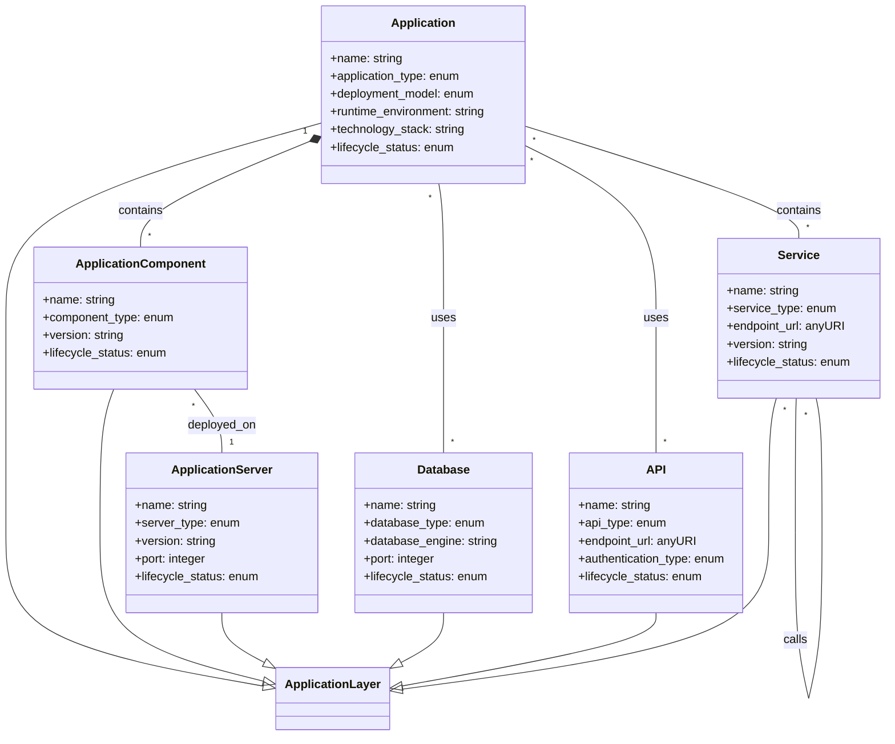
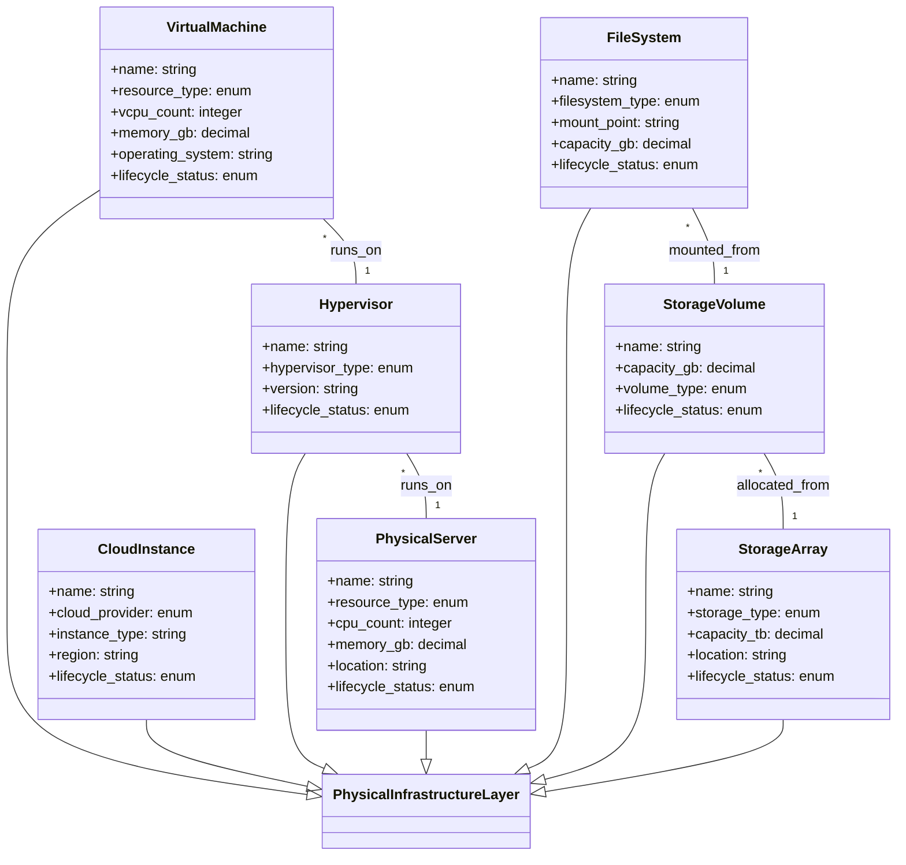
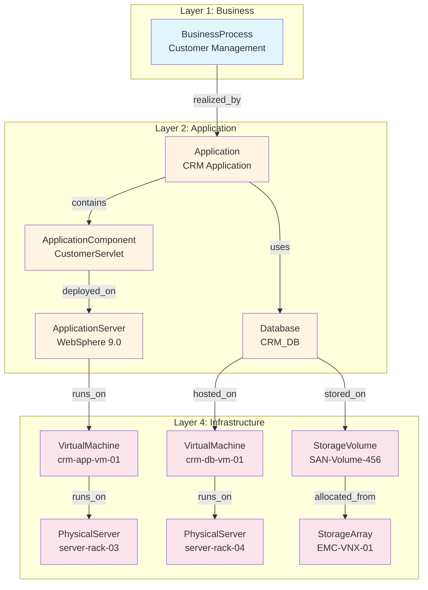
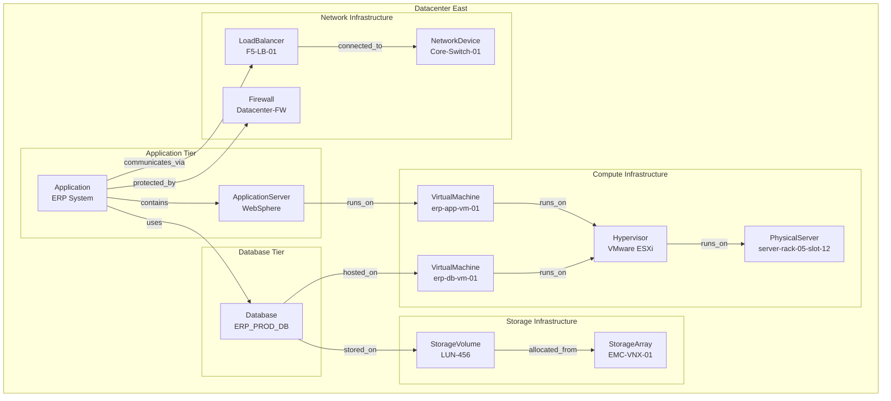
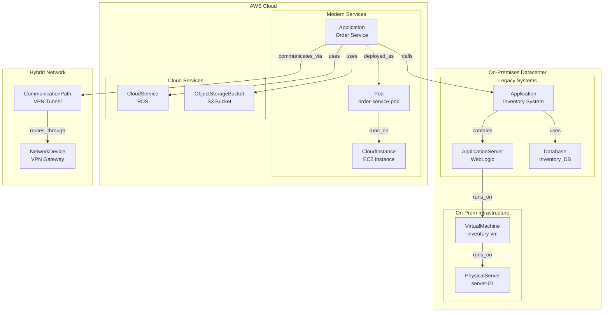

# IT Infrastructure Ontology - Visual Diagrams

## Document Information

- **Version**: 1.0.0
- **Date**: 2024-01-15
- **Purpose**: Visual representations of the ontology structure, relationships, and deployment patterns

---

## Table of Contents

1. [Layer Architecture Diagram](#layer-architecture-diagram)
2. [Entity-Relationship Diagrams by Layer](#entity-relationship-diagrams-by-layer)
3. [Cross-Layer Relationship Diagrams](#cross-layer-relationship-diagrams)
4. [Deployment Pattern Diagrams](#deployment-pattern-diagrams)
5. [Class Hierarchy Diagrams](#class-hierarchy-diagrams)

---

## Layer Architecture Diagram

### Six-Layer Architecture Overview

```mermaid
graph TB
    subgraph Layer1["Layer 1: Business Processes"]
        BP[BusinessProcess]
        BC[BusinessCapability]
        BS[BusinessService]
        P[Product]
    end
    
    subgraph Layer2["Layer 2: Application Layer"]
        APP[Application]
        AC[ApplicationComponent]
        AS[ApplicationServer]
        SVC[Service]
        API[API]
        DB[Database]
        MQ[MessageQueue]
        FS[FileStorageService]
        OS[ObjectStorageService]
    end
    
    subgraph Layer3["Layer 3: Container & Orchestration"]
        C[Container]
        POD[Pod]
        CI[ContainerImage]
        CL[Cluster]
        NS[Namespace]
        DEP[Deployment]
        K8S[KubernetesService]
        RT[Route]
    end
    
    subgraph Layer4["Layer 4: Physical Infrastructure"]
        PS[PhysicalServer]
        VM[VirtualMachine]
        HV[Hypervisor]
        CINST[CloudInstance]
        SA[StorageArray]
        SV[StorageVolume]
        FSYS[FileSystem]
    end
    
    subgraph Layer5["Layer 5: Network Topology"]
        ND[NetworkDevice]
        LB[LoadBalancer]
        NI[NetworkInterface]
        NSG[NetworkSegment]
        CP[CommunicationPath]
    end
    
    subgraph Layer6["Layer 6: Security Infrastructure"]
        FW[Firewall]
        WAF[WAF]
        CERT[Certificate]
        CA[CertificateAuthority]
        SP[SecurityPolicy]
        IDP[IdentityProvider]
        SZ[SecurityZone]
    end
    
    BP -->|realized_by| APP
    APP -->|deployed_as| POD
    POD -->|runs_on| VM
    VM -->|runs_on| PS
    APP -->|communicates_via| CP
    APP -->|protected_by| FW
    DB -->|stored_on| SV
    SV -->|allocated_from| SA
    
    style Layer1 fill:#e1f5ff
    style Layer2 fill:#fff4e1
    style Layer3 fill:#e8f5e9
    style Layer4 fill:#fce4ec
    style Layer5 fill:#f3e5f5
    style Layer6 fill:#fff9c4
```



---

## Entity-Relationship Diagrams by Layer

### Layer 1: Business Process Layer


### Layer 2: Application Layer



### Layer 3: Container and Orchestration Layer


### Layer 4: Physical Infrastructure Layer



### Layer 5: Network Topology Layer


### Layer 6: Security Infrastructure Layer


---

## Cross-Layer Relationship Diagrams

### Full Stack Decomposition: Business to Infrastructure


### Containerized Application Deployment Pattern


### Legacy Application Deployment Pattern



### Microservices Architecture with Service Mesh


---

## Deployment Pattern Diagrams

### Pattern 1: On-Premises Infrastructure



### Pattern 2: Cloud-Native Architecture (AWS)


### Pattern 3: Hybrid Cloud Architecture



### Pattern 4: Multi-Cloud Architecture


---

## Class Hierarchy Diagrams

### Complete Class Hierarchy

```mermaid
classDiagram
    class InfrastructureEntity {
        <<abstract>>
        +name: string
        +description: string
        +lifecycle_status: enum
    }
    
    class BusinessProcessLayer {
        <<abstract>>
    }
    
    class ApplicationLayer {
        <<abstract>>
    }
    
    class ContainerLayer {
        <<abstract>>
    }
    
    class PhysicalInfrastructureLayer {
        <<abstract>>
    }
    
    class NetworkLayer {
        <<abstract>>
    }
    
    class SecurityLayer {
        <<abstract>>
    }
    
    InfrastructureEntity <|-- BusinessProcessLayer
    InfrastructureEntity <|-- ApplicationLayer
    InfrastructureEntity <|-- ContainerLayer
    InfrastructureEntity <|-- PhysicalInfrastructureLayer
    InfrastructureEntity <|-- NetworkLayer
    InfrastructureEntity <|-- SecurityLayer
    
    BusinessProcessLayer <|-- BusinessProcess
    BusinessProcessLayer <|-- BusinessCapability
    BusinessProcessLayer <|-- BusinessService
    BusinessProcessLayer <|-- Product
    
    ApplicationLayer <|-- Application
    ApplicationLayer <|-- ApplicationComponent
    ApplicationLayer <|-- ApplicationServer
    ApplicationLayer <|-- Service
    ApplicationLayer <|-- API
    ApplicationLayer <|-- Database
    ApplicationLayer <|-- DatabaseInstance
    ApplicationLayer <|-- DataObject
    ApplicationLayer <|-- MessageQueue
    ApplicationLayer <|-- CacheService
    ApplicationLayer <|-- FileStorageService
    ApplicationLayer <|-- ObjectStorageService
    
    ContainerLayer <|-- Container
    ContainerLayer <|-- Pod
    ContainerLayer <|-- ContainerImage
    ContainerLayer <|-- Cluster
    ContainerLayer <|-- Namespace
    ContainerLayer <|-- Deployment
    ContainerLayer <|-- KubernetesService
    ContainerLayer <|-- Route
    ContainerLayer <|-- IngressController
    
    PhysicalInfrastructureLayer <|-- PhysicalServer
    PhysicalInfrastructureLayer <|-- VirtualMachine
    PhysicalInfrastructureLayer <|-- Hypervisor
    PhysicalInfrastructureLayer <|-- CloudInstance
    PhysicalInfrastructureLayer <|-- CloudService
    PhysicalInfrastructureLayer <|-- StorageArray
    PhysicalInfrastructureLayer <|-- StorageVolume
    PhysicalInfrastructureLayer <|-- FileSystem
    PhysicalInfrastructureLayer <|-- StoragePool
    PhysicalInfrastructureLayer <|-- CloudStorageService
    PhysicalInfrastructureLayer <|-- ObjectStorageBucket
    
    NetworkLayer <|-- NetworkDevice
    NetworkLayer <|-- LoadBalancer
    NetworkLayer <|-- NetworkInterface
    NetworkLayer <|-- NetworkSegment
    NetworkLayer <|-- CommunicationPath
    NetworkLayer <|-- NetworkRoute
    
    SecurityLayer <|-- Firewall
    SecurityLayer <|-- WAF
    SecurityLayer <|-- Certificate
    SecurityLayer <|-- CertificateAuthority
    SecurityLayer <|-- SecurityPolicy
    SecurityLayer <|-- IdentityProvider
    SecurityLayer <|-- SecurityZone
```



### Relationship Type Hierarchy


### Data Property Hierarchy


---

## Diagram Legend

### Color Coding

- **Light Blue** (#e1f5ff): Layer 1 - Business Processes
- **Light Orange** (#fff4e1): Layer 2 - Application Layer
- **Light Green** (#e8f5e9): Layer 3 - Container & Orchestration
- **Light Pink** (#fce4ec): Layer 4 - Physical Infrastructure
- **Light Purple** (#f3e5f5): Layer 5 - Network Topology
- **Light Yellow** (#fff9c4): Layer 6 - Security Infrastructure

### Relationship Arrows

- **Solid Arrow** (→): Direct relationship
- **Dashed Arrow** (⇢): Inheritance or subclass relationship
- **Bidirectional Arrow** (↔): Symmetric relationship

### Node Shapes

- **Rectangle**: Entity instance
- **Diamond**: Abstract class
- **Rounded Rectangle**: Concrete class

---

## Usage Notes

### Viewing Diagrams

These diagrams are written in Mermaid syntax and can be viewed in:

1. **GitHub**: Automatically rendered in markdown files
2. **VS Code**: Using Mermaid preview extensions
3. **Mermaid Live Editor**: https://mermaid.live/
4. **Documentation tools**: MkDocs, Docusaurus, GitBook with Mermaid plugins

### Exporting Diagrams

To export diagrams as images:

1. **Mermaid CLI**:
   ```bash
   mmdc -i VISUAL_DIAGRAMS.md -o diagrams/
   ```

2. **Mermaid Live Editor**: Copy diagram code and export as PNG/SVG

3. **VS Code**: Use Mermaid export extensions

### Customizing Diagrams

To customize diagrams for your organization:

1. Update entity names to match your environment
2. Adjust color schemes using `style` directives
3. Add or remove entities based on your architecture
4. Modify relationships to reflect your deployment patterns

---

**Document Version**: 1.0.0  
**Last Updated**: 2024-01-15  
**Diagram Format**: Mermaid  
**Total Diagrams**: 15+

